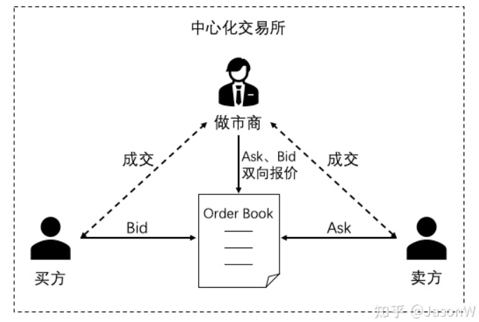
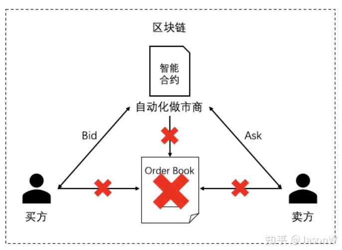

# uniswap_digest

## uniswap简介

Uniswap协议是一个用来在以太坊区块链上交易加密货币（ERC-20代币）的点对合约系统，简单点说就是通过智能合约实现了一个去中心化的ERC-20代币的自动交易系统。

任何人都可以再uniswap上创立流动池，一个流动池由一个代币对构成。假如你有一个项目发行了tokenCQ代币，你就能够创立ETH/tokenCQ的TokenPair为你的代币供给流动性。

## 相关名词解释

- **DEX：**去中心化交易所
- **Uniswap Labs：**负责开发Uniswap协议、网络接口的公司。
- **The Uniswap Protocol：**一个实现自动化做市商的智能合约全家桶，促进点对点做市和以太坊上ERC-20 token的交易的协议（即Uniswap核心技术，后续工作原理介绍也都是针对协议内容的解释）。
- **The Uniswap Interface：**为了方便使用Uniswap protocol而开发的网络接口，是与Uniswap protocol交互的众多方式之一（也可以直接与智能合约交互）。
- **Uniswap Governance：**一个Uniswap Protocol的民主治理系统（社区式治理方式，论坛模式）。

## uniswap发展历史

Uniswap诞生至今也不过两年多的时间，但是却创造了很多令人惊叹的记录：

- 2018年11月2日，Uniswap公开宣布上线并部署到以太坊主网，推出第一个版本Uniswap v1，但这个v1版本只能算是一个新型去中心化交易方式的概念验证，可实用性并不强。
- 2020年1月31日，经过1年多的沉淀，Uniswap锁仓金额突破5000万美元，成为DeFi龙头。
- 2020年5月19日，Uniswap v2版本上线，增加了自由组合交易对、价格预言机、闪贷、最优化交易路径等功能，对v1版本进行了全面的技术升级。
- 2020年7月27日，Uniswap 24小时交易额突破1亿美元，DeFi在2020年迎来爆发式增长。
- 2020年8月7日，Uniswap官方宣布已完成1100万美元的A轮融资，由Andreessen Horowitz领投。
- 2020年8月31日，Uniswap锁仓金额突破10亿美元。
- 2020年9月1日，Uniswap总交易量超过100亿美元。
- 2020年9月3日，Uniswap锁仓金额突破20亿美元，距离10亿美元仅仅过了3天，可见市场之火爆。
- 2020年9月17日，Uniswap宣布其协议治理代币UNI已在以太坊主网上发布，针对每一个之前使用过Uniswap protocol的区块链地址空投400个UNI，UNI的持有者有对平台新的发展及改变的提议的投票权。
- 2021年5月5日，Uniswap v3版本上线，提供了集中流动性、多重收费层次、高级价格预言机、流动性预言机等技术升级，核心是提升资本效率，具体实现可关注另一篇文章[Uniswap v3 设计详解](https://zhuanlan.zhihu.com/p/448382469)。有一点需要注意的是v1和v2版本都遵循的是GPL开源协议，但是v3使用的是Business Source License 1.1（有效时限GPL-2.0或更高版本的许可证）。该许可证将v3源代码在商业环境或生产环境中的使用期限限制为两年，届时它将永久转换为GPL许可证。

## 自动化做市商

自动化做市商（Automated Market Maker，AMM），在开始介绍Uniswap之前，先来说说中心化的交易所是怎么交易的

在传统中心化交易所中，你以一个价格发出买单，系统会在order book寻找合适的卖单进行撮合成交，如果当前没有合适的对手单，则将新的订单暂存到order book中等待合适的对手单出现。买方===>Order Book<===卖方。

买方以自己希望买入的价格挂买单，进入订单薄下方并按价格从高到低排序，价格最高成为买1； 卖方以自己希望卖出的价格挂卖单，进入订单薄的上方并按价格从低到高排序，价格最低成为卖1；订单薄上方的买单和下方的卖单按顺序撮合成交，如果没有合适的对手单时，交易就不能完成，订单挂在订单薄上等待。这种模式下，如果买卖双方不够活跃，用户发出的买单或者卖单无法快速找到交易对手方进行撮合，就会出现长时间的挂单，交易效率低下，这时就出现了做市商

这个order book以中心系统的形式保存了所有买单、买单的信息，如下图所示：

|          |           | Ask Price | Ask Size |
| -------- | --------- | --------- | -------- |
|          |           | 103       | 40       |
|          |           | 102       | 23       |
|          |           | 101       | 10       |
|          |           |           |          |
| 20       | 99        |           |          |
| 15       | 98        |           |          |
| 35       | 97        |           |          |
| Bid Size | Bid Price |           |          |

在这种中心化交易平台上，每笔交易的撮合并不需要通过区块链，而是在中心化系统中实现，保证了交易的高并发和低时延，但如果平台上的买卖双方不够活跃，用户发出的买单或者卖单无法快速找到交易对手方进行撮合，就会出现长时间的挂单，交易效率低下，这时就出现了做市商。

做市商是指在传统证券市场上，由具备一定实力和信誉的独立证券经营法人作为特许交易商，不断向公众投资者报出某些特定证券的买卖价格（即双向报价），并在该价位上接受公众投资者的买卖要求，以其自有资金和证券与投资者进行证券交易。买卖双方不需等待交易对手出现，只要有做市商出面承担交易对手方既可达成交易。

做市商通过做市制度来维持市场的流动性，满足公众投资者的投资需求。做市商通过买卖报价的适当差额来补偿所提供服务的成本费用，并实现一定的利润，但是在中心化平台中，买方/卖方并不确定做市商是否真的在区块链上有实际的资产（账户中的余额只是中心化数据库中的一个数字），而且用户的资产都保存在中心化交易所的钱包里，自己没有绝对的控制权，而中心化交易所也没接受任何监管机构的监管，很容易发生监守自盗的事件。

基于以上种种弊端，Uniswap提出了一种通过智能合约实现**自动化做市商（Automated Market Maker，AMM）**来与用户进行交易的去中心化交易协议，用户资产完全由自己控制，而智能合约中锁定的做市资产也是公开可查，是一种更安全透明的交易方式。

