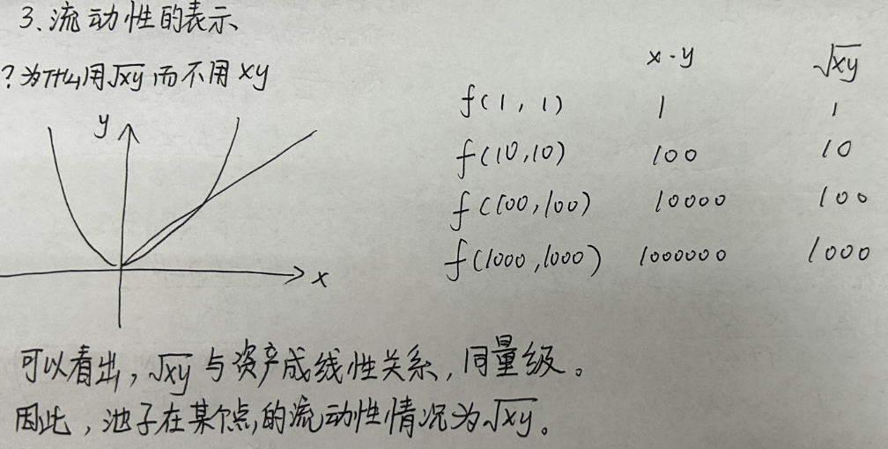
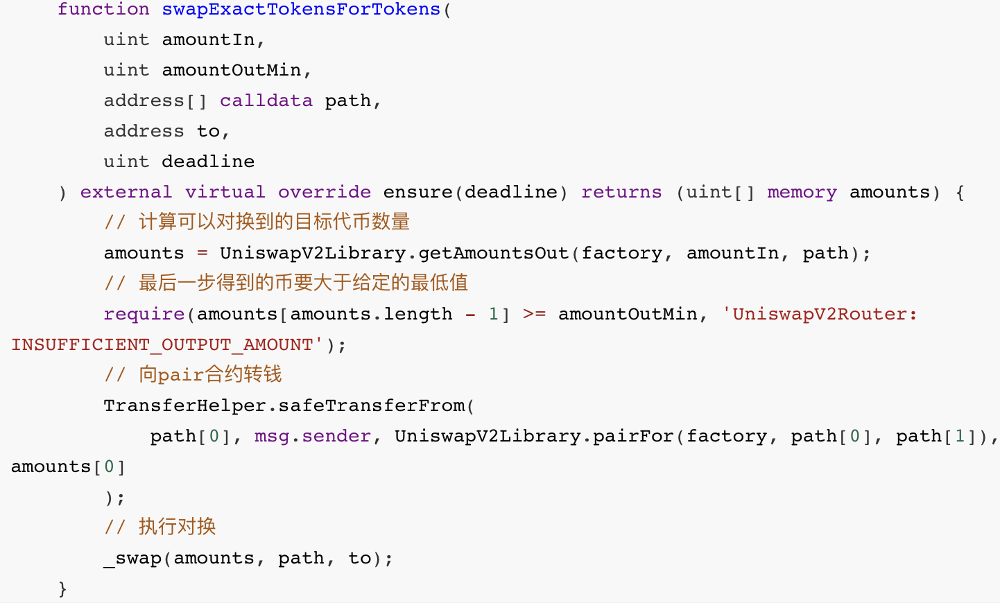

# uniswap_v2_theory

## v1存在的问题

1. 不能直接创立两种ERC20代币的流动性池，只能创立ETH和ERC20代币的流动性池。这样两种ERC20代币就不能直接兑换，需要经过ETH转化，导致了当交易者需要将代币A换成代币B时，中间还需要买入卖出ETH并支付两笔交易费和gas费，成本高昂。
2. 在实践的运行过程中，受制于以太坊吞吐量和速度的问题，Uniswap也遭遇过价格操作的状况。
3. 刚开始起阶段，交易规模在整个加密世界还非常小，流动性深度不足，容易出现价格剧烈波动的情况。
4. 也不能支持链式的兑换，例如：ETH-JCB-USDT-DAI 
5. 作为一个DEX，v1也没有提供价格预言的机制

## V2架构


## 特点

- 支持任意ERC20代币的交易对，允许流动性提供者为任意两个ERC-20代币创建交易对合约。

- 提供价格预言机功能
- 提供闪电贷功能
- 不可升级
- 支持在工厂合约中修改一个变量，以便允许Uniswap协议针对每笔交易收取0.05%的手续费（即0.3%的1/6）。该手续费默认关闭，但是可以在未来被打开，在打开后流动性提供者将只能获取0.25%手续费，而非0.3%。【因为其中0.05%分给协议，关于0.05%协议手续费这个开关，后续引发了Sushiswap和Uniswap的流动性大战，Sushiswap fork Uniswap代码，[将0.05%协议手续费分给SUSHI持有者](https://docs.sushi.com/products/yield-farming/the-sushibar#what-is-xsushi)，一度要将Uniswap流动性抢走；并最终迫使Uniswap发行了自己的代币UNI。】

## k值

### 公式


**考虑手续费**

设手续费为ρ，0≦ρ﹤1，γ=1-ρ。uniswap的手续费为0.3%
$$
XY=(X+\gamma \Delta X)(Y-\Delta Y)
$$

$$
{\Delta X}={X\Delta Y \over {(Y - \Delta Y)}\gamma}
$$

### 特点

我们拿uniswap里的一个交易对，ETH/USDT来举例说明K值是怎么设计的。

- 恒定乘积算法。

  - uniswap里第一个人添加x个ETH和y个USDT的作为流动性时，决定了K值的初始大小，即K=x*y。
  
  
    - 这时，ETH和USDT共同构成了一个流动性池。
  
  
    - 第一个添加流动性的人，可以任意添加交易对中的两个币的数量，即可以任意决定K值。
  
  
    - 添加完流动性后，ETH的价格就等于=y(USDT的数量)/x(ETH的数量)。如果这个价格和其他交易所之间有价差，那肯定会被人搬砖套利。
  
  
    - 所谓的恒定乘积算法，指的是在流动性池没有再添加或减少流动性的情况下，只有交易行为发生的情况下，K值是不变的。即如果用户在ETH/USDT交易对里买入或卖出ETH，都无法改变K值的大小。
  
  
    - 而交易行为会修改流动性池里的ETH和USDT的成分。比如用户买了dx个ETH，则流动性池里的ETH的数量就会变成（x-dx），而usdt的数量则变成了K/(x-dx)，即用户需要花dy=K/(x-dx)-y个USDT来买dx个ETH。
  


- 添加流动性增加K值

  - 如果现在资金池里有xETH/yUSDT，K=x*y。现在有人又添加了流动性，增加了dx个ETH和dy个usdt，并且dx/dy=x/y。
  
  
  - 如果你使用Uniswap的默认设定，即你添加流动性时，先输入ETH的数量，然后uniswap会默认计算出需要多少USDT，这个默认计算就是保持dx/dy=x/y。
  - 但，添加完流动性后，流动性池里的资金变成了：(x+dx)ETH/(y+dy)USDT。此时，(x+dx)*(y+dy)>x*y。所以添加流动性K值变大了。
  


- 同样的减少流动性，会减少K值。

- 捐赠影响K值

  - 如果你在添加流动性时，不是按dx/dy=x/y的比例去添加，而是直接往合约地址里转了dx>0，dy=0，也是可以的。这同样会改变K值。
  
  
    - 这样的事是经常发生的，有些人错误地将ETH转入一个uniswap流动性池合约地址里，就产生了捐赠行为，白白把币送给了所有原来的流动性所有者。
  
  
    - 这种非K值比例添加流动性的行为，被uniswap称为捐赠。
  
  
  - 但这种捐赠行为，在设计上是可以被其他人套利的。比如有人充值了dx>0，dy=0；此时另外的人可以充值按K值比例的dy，并且执行一个添加流动性的操作，就可以把那dx的捐赠给薅走。
  - 任何不是按K值比例添加的流动性，都会产生捐赠。比如dx/dy>x/y，则先添加(dx-ddx)/dy=x/y的流动性，并返回给用户对应数量的LPtoken。然后ddx就变成了捐赠。
  

### 例子

原本流动性池有5个tokenA和20个tokenB，所以X=5和Y= 20。

Tim拥有一个tokenA，当Tim换掉1个tokenA时，他会先支付0.3%的手续费，也就是0.003个tokenA (0.3%*1)。支付费用后，剩余的tokenA，也就是0.997 tokenA，会换成tokenB，所以新的X变成了5.997 tokenA。

由于K必须保持不变，新的Y可以从公式中计算出来X * Y= newX * newY。所以newY 是16.675004 (X * Y/newX = 5 * 20/ 5.997= 16.675004)。这意味着池中将持有16.675004个tokenB，剩余的tokenB将发送给Tim，这意味着Tim 将收到3.324996个tokenB (Y - newY = 20 -16.675004 = 3.324996)。

交换后，池中有5.997个tokenA和16.675004个tokenB。【不太对，因为手续费没加上去，K值应该是会稍微变大的】

在 Uniswap V2 中，手续费会留在池子里，而不是直接发送给流动性提供者。每次发生交易时，用户需要支付 0.3% 的手续费。这些费用会以增加储备量的形式添加到池子里。因此，手续费实际上是通过提高流动性池中的代币储备来间接奖励流动性提供者的。

当流动性提供者想要退出并赎回其份额时，他们可以获得池子中的代币，这时候就包括了那部分累积的手续费。换句话说，流动性提供者可以通过增加的储备量获得手续费收益，而这些增加的储备量正是由于交易产生的手续费。

## 流动性

### 理论

- 添加流动性：合约为流动性提供者铸造流动性代币。持有多少流动性代币，就表示为流动性池贡献了多少份额，也表示享有流动性池多少权益。
- 移除流动性：当他们取消做市的时候，把LP Token换成池子中的代币。由于用户买卖过程中需要手续费，手续费会放到池子中，最终给LP获得

### 公式

流动性的表示



添加流动性


移除流动性


### 代码

```solidity
pragma solidity ^0.8.13;

import "./IERC20.sol";
// 不考虑手续费
contract CPAMM{
    IERC20 public immutable token0; // 池子中的token0
    IERC20 public immutable token1; // 池子中的token1

    uint256 public reserve0; // 池子中的token0数量
    uint256 public reserve1; // 池子中的token1数量

    uint256 public totalSupply; // 总共的LPtoken数量
    mapping(address => uint256) public balanceOf;

    constructor(address _token0, address _token1) public{
        token0 = IERC20(_token0);
        token1 = IERC20(_token1);
    }

    function _mint(address _to, uint256 _amount) private{
        balanceOf[_to] += _amount;
        totalSupply += _amount;
    }

    function _burn(address _from, uint256 _amount) private{
        balanceOf[_from] -= _amount;
        totalSupply -= _amount;
    }

    function _update(uint256 _reserve0, uint256 _reserve1) private {
        reserve0 = _reserve0;
        reserve1 = _reserve1;
    }

    function swap(address _tokenIn, uint256 _amountIn) external returns(uint256 amountOut){
        require(_amountIn > 0, "Invalid Amount");
        require(_tokenIn == address(token0) || _tokenIn == address(token1));

        // 确定转进合约的币是token0还是token1
        bool isToken0 = _tokenIn == address(token0);
        (IERC20 tokenIn, IERC20 tokenOut) = isToken0 ? (token0,token1):(token1,token0);
        // 确定池子中 X, Y 的数量
        (uint256 reserveIn, uint256 reserveOut) = isToken0? (reserve0,reserve1) : (reserve1,reserve0);

        // 转币到合约，操作之前记得approve
        tokenIn.transferFrom(msg.sender,address(this),_amountIn);
        // 计算输出的数量
        amountOut = (_amountIn * reserveOut) / (reserveIn + _amountIn);
        // 转币给用户
        tokenOut.transfer(msg.sender,amountOut);
        // 更新自己的余额表
        _update(token0.balanceOf(address(this)), token1.balanceOf(address(this)));
    }

    function addLiquidity(uint256 _amount0, uint256 _amount1) external returns(uint256 shares){
        require(_amount0 > 0 && _amount1 > 0, "Invalid value");
        // 把 token0 和 token1 转入到合约, 操作之前记得先approve
        token0.transferFrom(msg.sender, address(this), _amount0);
        token1.transferFrom(msg.sender, address(this), _amount1);
        // 计算并mint share给用户
        if( reserve0 > 0 || reserve1 > 0){ // 如果之前已经有人添加过流动性
            require(_amount0 * reserve1 == _amount1 * reserve0, "dy/dx != y/x");
        }
        if(totalSupply == 0){ // 第一次添加流动性
            shares = _sqrt(_amount0 * _amount1);
        }else{
            // 为了合约的安全，我们取小的哪个： shares的计算-添加流动性那里的公式
            shares = _min(
                (_amount0 * totalSupply) / reserve0 ,
                (_amount1 * totalSupply) / reserve1 
            );
        }
        require(shares > 0, "share is zero");
        _mint(msg.sender,shares);
        // 更新余额表
        _update(token0.balanceOf(address(this)), token1.balanceOf(address(this)));
    }

    function _sqrt(uint256 y) internal pure returns(uint256 z){
        if(y > 3){
            z = y;
            uint256 x = y / 2 + 1;
            while(x < z){
                z = x;
                x = ( y / x + x) / 2;
            }
        }else if( y != 0){
            z = 1;
        }
    }

    function _min(uint256 _x, uint256 _y) private pure returns(uint256){
        return _x > _y ? _y : _x;
    }

    function removeLiquidity(uint256 _shares) external returns(uint256 amount0, uint256 amount1){
        require(_shares > 0, "Invalid shares");
        // 计算 dx 和 dy 的数量
        amount0 = (_shares * reserve0) / totalSupply;
        amount1 = (_shares * reserve1) / totalSupply;
        // 销毁用户的share 
        _burn(msg.sender, _shares);
        // 把两个币转回给用户
        token0.transfer(msg.sender, amount0);
        token1.transfer(msg.sender, amount1);
        // 更新余额表
        _update(token0.balanceOf(address(this)), token1.balanceOf(address(this)));
    }
}
```

## 预言机

### 原理

其原理是在每个区块开始时累计两种代币的相对价格，这将允许其他以太坊合约可以获取任意时间段内两种代币的时间加权平均价格

1


2


3


### 代码

下面是实现的更新价格、获取价格的方法

```solidity
// SPDX-License-Identifier: MIT
pragma solidity 0.6.6;

import "@uniswap/v2-core/contracts/interfaces/IUniswapV2Pair.sol";
import "@uniswap/lib/contracts/libraries/FixedPoint.sol";
import "@uniswap/v2-periphery/contracts/libraries/UniswapV2OracleLibrary.sol";
import "@uniswap/v2-periphery/contracts/libraries/UniswapV2Library.sol";


contract UniswapV2TWAP {
    using FixedPoint for *; // 解决小数问题

    uint public constant PERIOD = 1 hours; // 最小间隔时间

    IUniswapV2Pair public immutable pair; // 池子的地址
    address public immutable token0;
    address public immutable token1;

    uint public price0CumulativeLast; // token0累计价格
    uint public price1CumulativeLast; // token1累计价格
    uint public blockTimestampLast; // 上一次计算的时间

    FixedPoint.uq112x112 public price0Average; // token0的平均价格
    FixedPoint.uq112x112 public price1Average; // token1的平均价格

    constructor(IUniswapV2Pair _pair) public {
        pair = IUniswapV2Pair(_pair);
        token0 = _pair.token0();
        token1 = _pair.token1();
        price0CumulativeLast = _pair.price0CumulativeLast();
        price1CumulativeLast = _pair.price1CumulativeLast();
        (, , blockTimestampLast)= _pair.getReserves();
    }

    // 任何人都可以更新价格，项目方鼓励大家一起来更新价格
    function update() external {
        // 找到当前累计的价格
       (
           uint price0Cumulative,
           uint price1Cumulative,
           uint32 blockTimestamp
       ) = UniswapV2OracleLibrary.currentCumulativePrices(address(pair));

       uint timeElapsed = blockTimestamp - blockTimestampLast;
       require(timeElapsed > 1 hours, "time elapsed < 1h");

       price0Average = FixedPoint.uq112x112(
           uint224((price0Cumulative - price0CumulativeLast) / timeElapsed)
           );
        price1Average = FixedPoint.uq112x112(
           uint224((price1Cumulative - price1CumulativeLast) / timeElapsed)
           );

        price0CumulativeLast = price0Cumulative;
        price1CumulativeLast = price1Cumulative;
        blockTimestampLast = blockTimestamp;
    }

    // 输入一定数量的token，得到多少另外一种token
    function consult(address token, uint amountIn) external view returns(uint amountOut) {
           require(token == token0 || token == token1);
           if (token == token0) {
               amountOut = price0Average.mul(amountIn).decode144();
           } else {
               amountOut = price1Average.mul(amountIn).decode144();
           }
       }

}
```

## 交换

如果是币币交换，那么要transferFrom一定的代币到合约，然后再swap。但是假如在这两步当中，其他人swap咋办？这个问题是不是因为交易的原子性，防止了这个问题呢

1.先转入代币
2.swap
有人在1.5步提前swap了

这个情形不会发生，因为1和2这两步是在同一个tx中，tx具有原子性，不会被1.5插队，这样的逻辑是吧？

答案：向合约发代币和调swap应该在一笔交易中，通常是前端调router合约实现的



自己调用也可以


如果转token和调swap分开进行就是做慈善，转入token但没swap出代币会导致滑点偏移，会被套利机器人以最快速度转走

**代币兑换代币**


**例子**

假如最初池子里有10ETH和500TokenCQ

1. K = 10 * 500 = 5000
2. TokenCQ购买者发送：1ETH
3. 手续费：1 * 0.25% = 0.0025ETH
4. ETH_POOL = 10 + 1 - 0.0025 = 10.9975 ETH
5. TokenCQ _POOL = 5000 / 10.9975 = 454.65 TokenCQ
6. 购买者得到TokenCQ = 500 - 454.65 = 45.35 TokenCQ

由于手续费会在计算后被添加到资金池中，所以不变量`K`会随着每次交易稍微变大，为流动性提供者提供系统性盈利。故此，不变量表示的是上次交易结束后`ETH_POOL（ETH 资金池） * TokenCQ_POOL（TokenCQ 资金池）`的值。

1. ETH_POOL（ETH 资金池） = 10.9975 + 0.0025 = 11
2. Token_POOL（TokenCQ 资金池） = 454.65
3. K（新的不变量） = 11 * 454.65 = 5,001.15

## 手续费&协议费


```solidity
function _mintFee(uint112 _reserve0, uint112 _reserve1) private returns (bool feeOn) {
    address feeTo = IUniswapV2Factory(factory).feeTo();
    // 如果是首次添加流动性，则不需要计算交易协议费
    // 如果不是首次添加流动性，则需要交易协议费
    feeOn = feeTo != address(0);
    // KLast是上一次添加或者删除流动性时保存的
    uint _kLast = kLast; // gas savings
    if (feeOn) {
        if (_kLast != 0) { // 删除流动性的时候，这个也会进入，因此也会返回协议费
            uint rootK = Math.sqrt(uint(_reserve0).mul(_reserve1));
            uint rootKLast = Math.sqrt(_kLast);
            if (rootK > rootKLast) {
                uint numerator = totalSupply.mul(rootK.sub(rootKLast));
                uint denominator = rootK.mul(5).add(rootKLast);
                uint liquidity = numerator / denominator;
                if (liquidity > 0) _mint(feeTo, liquidity); // 将LP转给to地址
            }
        }
    } else if (_kLast != 0) { // 如果我们已经开启feeOn，如果想再次关掉feeOff的话，需要将KLast设置为0
        kLast = 0;
    }
}
```

在UniswapV2Factory.sol中设置`setFeeTo()`和`setFeeToSetter()`：`setFeeTo()`用来协议费给到哪个地址，`setFeeToSetter()`用来转让管理权

## 无常损失

### 原理

- 定义：向某个流动性挖矿池中提供流动性，移除流动性的时候，发现比“如果不提供流动性”赚得少（发现比“如果不提供流动性”亏得多），损失的量叫做无常损失


- 本质上，无常损失是提供流动性时发生的资金暂时损失/非永久性损失。之所以叫做非永久性损失，是因为只要在AMM中的代币相对价格恢复到其初始状态，那么，该损失就消失了。但是，这种情况很少发生。通常，无常损失会变成永久性损失，吞掉你的交易费用收入甚至导致负回报。


- 当AMM中的代币市场价格在涨或跌时，就会产生无常损失。波动越大，无常损失越大。
- 无常损失计算器：[计算器](https://yieldfarmingtools.com/tools)

### 例子

假设这个池子只有我提供流动性，”如果我没添加流动性“的意思是“池子流动性是另外一个人提供的”。由于LP只有我，因此池子中不管怎么变，里面的代币在我移除流动性的时候都是我的。

池子的ETH涨价：此时无常损失=244.58-240=4.58

| 行为               | 添加流动性   | 池子资产       | 池子中ETH价格  | 我的总资产                                      |
| ------------------ | ------------ | -------------- | -------------- | ----------------------------------------------- |
| 我添加流动性       | 100DAI: 1ETH | 100DAI,1ETH    | 1ETH=100DAI    | 100DAI+1ETH = 100DAI + 100DAI = 200DAI          |
| 有人在池子交换     |              | 120DAI,0.83ETH | 1ETH=144.58DAI | 120DAI+0.83ETH = 120DAI + 120DAI = 240DAI       |
| 如果我没添加流动性 |              |                |                | 100DAI + 1 ETH = 100DAI + 144.58DAI = 244.58DAI |

池子的ETH降价：此时无常损失=164-160=4

| 行为               | 添加流动性   | 池子资产      | 池子中ETH价格 | 我的总资产                             |
| ------------------ | ------------ | ------------- | ------------- | -------------------------------------- |
| 我添加流动性       | 100DAI: 1ETH | 100DAI,1ETH   | 1ETH=100DAI   | 100DAI+1ETH = 100DAI + 100DAI = 200DAI |
| 有人在池子交换     |              | 80DAI,1.25ETH | 1ETH=64DAI    | 80DAI+1.25ETH=80DAI+80DAI=160DAI       |
| 如果我没添加流动性 |              |               |               | 100DAI+1ETH=100DAI+64DAI=164DAI        |

### 公式


## 滑点

### 原理


### 例子


### 产生原因

- 高交易量导致价格下滑
- 流动性低导致价格下滑

### 避免滑点

请记住，价格滑点发生在您确认交易和该交易在区块链上确认之间的时刻。如果区块链有大量交易支持，矿工会优先处理支付最多 gas 的交易。根据这个简单的事实，遵循一些非常有效的方法来减少滑点。

- 使用更多的gas：使用快速 gas 支付意味着您的交易可以立即结算，从而减少滑点影响您交易的回旋余地。在试图计算出要支付多少 gas 时，有两个宝贵的资源是：

  - [Etherscan 气体追踪器](https://etherscan.io/gastracker)

  - [ETH加油站](https://ethgasstation.info/)


- 在lay 2解决方案上进行交易：如果您觉得价格下滑与您的交易得到确认的速度有很大关系，那么您就对了。由于第 2 层扩展解决方案的兴起，您无需支付更多费用即可获得快速交易。第 2 层具有相反的效果，使您的交易比在以太坊上便宜得多。


- 调整滑点容忍水平：大多数去中心化交易所都为您提供了调整滑点容忍度的选项。您可以针对不同情况增加或减少滑点容忍度百分比，以确保您的交易得到处理。[Uniswap 让您可以通过点击掉期界面](https://app.uniswap.org/#/swap)上的设置符号轻松调整您的滑点。


## 闪电贷

在Uniswap v1，用户如果想使用XYZ购买ABC，则需要先将XYZ发送到合约才能收到ABC。这将给那些希望使用ABC购买XYZ的用户带来不便。比如，当Uniswap与其他合约出现套利机会时，用户可能希望使用ABC在别的合约购买XYZ；或者用户希望通过卖出抵押物来释放他们在Maker或Compound的头寸，以此偿还Uniswap的借款。

Uniswap v2增加了一个新特性，允许用户在支付费用前先收到并使用代币，只要他们在同一个交易中完成支付。swap方法会在转出代币和检查k值两个步骤之间，调用一个可选的用户指定的回调合约。一旦回调完成，Uniswap合约会检查当前代币余额，并且确认其满足k值条件（在扣除手续费后）。如果当前合约没有足够的余额，整个交易将被回滚。

用户可以只归还原始代币，而不需要执行交易操作。这个功能将使得任何人可以闪电借出Uniswap池子中的任意数量的代币（闪电贷手续费与交易手续费一致，都是0.30%）。

> 注：闪电贷在DeFi领域非常实用，对于TVL较高的协议，协议可以通过闪电贷获取手续费收入。比如dYdX和Aave，都推出了闪电贷功能。Uniswap v2合约中的闪电贷与交易功能实际上使用同一个swap方法。

## 气体消耗

由于其简约的设计，Uniswap 的 gas 效率非常高。对于 ETH 到 ERC20 的交易，它使用的 gas 比 Bancor 少近 10 倍。它可以比 0x 更有效地执行 ERC20 到 ERC20 的交易，并且与 EtherDelta 和 IDEX 等链上订单簿交易所相比具有显着的气体减少。

| Exchange       | Uniswap | EtherDelta | Bancor | Radar Relay(0x) | IDEX   | Airswap |
| -------------- | ------- | ---------- | ------ | --------------- | ------ | ------- |
| ETH to ERC20   | 46000   | 108000     | 440000 | 113000          | 143000 | 90000   |
| ERC20 to ETH   | 60000   | 93000      | 403000 | 113000          | 143000 | 120000  |
| ERC20 to ERC20 | 88000   | /          | 538000 | 113000          | /      | /       |
| WETH           | /       | /          | /      | /               | /      | /       |

## 自定义池

附加功能`tokenToExchangeSwap()`和`tokenToExchangeTransfer()`增加了 Uniswap 的灵活性。这些函数将 ERC20 代币转换为 ETH，并尝试用`ethToTokenTransfer()`在用户输入的地址上进行转换。这允许 ERC20 到 ERC20 与来自不同工厂的自定义 Uniswap 交易所进行交易，只要它们实现适当的接口即可。自定义交易所可以有不同的曲线、经理、私人流动资金池、基于 FOMO 的庞氏骗局，或任何你能想到的。


