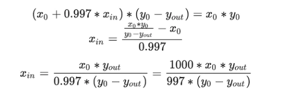

# uniswap_v2_code

Uniswap v2的合约主要分为两类：core合约和periphery合约。其中，core合约仅包含最基础的交易功能，核心代码仅200行左右，由于用户资金都存储在core合约里，因此需要保证core合约最简化，避免引入bug；periphery合约则针对用户使用场景提供多种封装方法，比如支持原生ETH交易（自动转为WETH），多路径交换（一个方法同时执行A→B→C交易）等，其底层调用的是core合约。我们在[app.uniswap.org](https://app.uniswap.org/#/swap)界面操作时用的就是periphery合约。


- uniswap-v2-core
  - UniswapV2Factory：工厂合约，用于创建Pair合约（以及设置协议手续费接收地址）
  - UniswapV2Pair：Pair（交易对）合约，定义和交易有关的几个最基础方法，如swap/mint/burn，价格预言机等功能，其本身是一个ERC20合约，继承UniswapV2ERC20
  - UniswapV2ERC20：实现ERC20标准方法
- uniswap-v2-periphery
  - UniswapV2Router02：最新版的路由合约，相比UniswapV2Router01增加了对FeeOnTransfer代币的支持；实现Uniswap v2最常用的接口，比如添加/移除流动性，使用代币A交换代币B，使用ETH交换代币等
  - UniswapV1Router01：旧版本Router实现，与Router02类似，但不支持FeeOnTransferTokens，目前已不使用

## uniswap-v2-core

### UniwapV2ERC20

这个合约主要定义了UniswapV2的ERC20标准实现，代码比较简单。这里介绍下permit方法：

```solidity
function permit(address owner, address spender, uint value, uint deadline, uint8 v, bytes32 r, bytes32 s) external {
    require(deadline >= block.timestamp, 'UniswapV2: EXPIRED');
    bytes32 digest = keccak256(
        abi.encodePacked(
            '\x19\x01',
            DOMAIN_SEPARATOR,
            keccak256(abi.encode(PERMIT_TYPEHASH, owner, spender, value, nonces[owner]++, deadline))
        )
    );
    address recoveredAddress = ecrecover(digest, v, r, s);
    require(recoveredAddress != address(0) && recoveredAddress == owner, 'UniswapV2: INVALID_SIGNATURE');
    _approve(owner, spender, value);
}
```

permit方法实现的就是白皮书2.5节中介绍的“Meta transactions for pool shares 元交易”功能。[EIP-712](https://eips.ethereum.org/EIPS/eip-712)定义了离线签名的规范，即digest的格式定义，用户签名的内容是其（owner）授权（approve）某个合约（spender）可以在截止时间（deadline）之前花掉一定数量（value）的代币（Pair流动性代币），应用（periphery合约）拿着签名的原始信息和签名后生成的v, r, s，可以调用Pair合约的permit方法获得授权，permit方法使用ecrecover还原出签名地址为代币所有人，验证通过则批准授权。

### UniswapV2Pair

Pair合约主要实现了三个方法：mint（添加流动性）、burn（移除流动性）、swap（兑换）。

#### mint

该方法实现添加流动性功能。

```solidity
    function mint(address to) external lock returns (uint liquidity) {
        // getReserves() 获取两种代币的缓存余额
        // 保存缓存余额是为了防止攻击者操控价格预言机
        // 还用于计算协议手续费，并通过当前余额与缓存余额相减获得转账的代币数量。
        
        // 这两个值是上次添加或者删除流动性的时候，保存的值
        (uint112 _reserve0, uint112 _reserve1,) = getReserves(); // gas savings
        // 现在的库存量，通常balance0和balance1是要比库存多的，因为我们刚刚转进来了一些
        uint balance0 = IERC20(token0).balanceOf(address(this));
        uint balance1 = IERC20(token1).balanceOf(address(this));
        uint amount0 = balance0.sub(_reserve0);
        uint amount1 = balance1.sub(_reserve1);

        bool feeOn = _mintFee(_reserve0, _reserve1);
        uint _totalSupply = totalSupply; // gas savings, must be defined here since totalSupply can update in _mintFee
        if (_totalSupply == 0) { //判断是否是头一次添加流动性
            // 安全隐患：
            // 流动性比例由第一个人来设置，一旦设置，变化的幅度就很小了
            // 因此项目方必须在提前设置，不能让他人抢先设置
            liquidity = Math.sqrt(amount0.mul(amount1)).sub(MINIMUM_LIQUIDITY); 
           _mint(address(0), MINIMUM_LIQUIDITY); // permanently lock the first MINIMUM_LIQUIDITY tokens
        } else {
            liquidity = Math.min(amount0.mul(_totalSupply) / _reserve0, amount1.mul(_totalSupply) / _reserve1);
        }
        require(liquidity > 0, 'UniswapV2: INSUFFICIENT_LIQUIDITY_MINTED');
        _mint(to, liquidity);

        _update(balance0, balance1, _reserve0, _reserve1);
        if (feeOn) kLast = uint(reserve0).mul(reserve1); // reserve0 and reserve1 are up-to-date
        emit Mint(msg.sender, amount0, amount1);

        // mint方法中判断，如果是首次提供该交易对的流动性，则根据根号xy生成流动性代币，
        // 并销毁其中的MINIMUM_LIQUIDITY（即1000wei）；否则根据转入的代币价值与当前流动性价值比例铸造流动性代币。
    }
```

首先，getReserves() 获取两种代币的缓存余额。在白皮书中提到，保存缓存余额是为了防止攻击者操控价格预言机。此处还用于计算协议手续费，并通过当前余额与缓存余额相减获得转账的代币数量。

`liquidity = Math.sqrt(amount0.mul(amount1)).sub(MINIMUM_LIQUIDITY);`：几何平均数，uniswap项目方应该是认为这个公式更加适合金融，而不是用算数平均数。同时他还减去了最小的流动性3000Wei的代币，其实不是删除，而是扣留下来，以防止被除数是0，没有人能够提走这3000Wei代币。还有一种说法是增加攻击的成本：第一次添加流动性的时候，tokenA和tokenB都添加1wei的代币，产生了1wei的流动性，然后第二次添加流动性（此时添加多少代币就增加多少流动性），此时黑客增加10W个代币流动性，他就获得了10w个流动性代币，3000Wei的首次添加流动性增加了攻击门槛


`liquidity = Math.min(amount0.mul(_totalSupply) / _reserve0, amount1.mul(_totalSupply) / _reserve1);`：tokenA和tokenB的流动性，取小值。原因：如果取大的作为流动性，那么就会稀释之前的流动性，稀释股份，影响到别人，而取小的，只会影响自己。如何计算流动性呢：lp是总的流动性，也就是总的lp代币数量，x是tokenA库存的总数量，Δx是我们存入的tokenA的数量，得到的就是我们应得到的lp代币的数量


#### _mintFee

用于计算协议手续费：

```solidity
    // 用于计算协议手续费
    // 为了节省交易手续费，Uniswap v2只在mint/burn流动性时收取累计的协议手续费。
    // if fee is on, mint liquidity equivalent to 1/6th of the growth in sqrt(k)
    function _mintFee(uint112 _reserve0, uint112 _reserve1) private returns (bool feeOn) {
        address feeTo = IUniswapV2Factory(factory).feeTo();
        // 如果是首次添加流动性，则不需要计算交易协议费
        // 如果不是首次添加流动性，则需要交易协议费
        feeOn = feeTo != address(0);
        // KLast是上一次添加或者删除流动性时保存的
        uint _kLast = kLast; // gas savings
        if (feeOn) {
            if (_kLast != 0) { // 删除流动性的时候，这个也会进入，因此也会返回协议费
                uint rootK = Math.sqrt(uint(_reserve0).mul(_reserve1));
                uint rootKLast = Math.sqrt(_kLast);
                if (rootK > rootKLast) {
                    uint numerator = totalSupply.mul(rootK.sub(rootKLast));
                    uint denominator = rootK.mul(5).add(rootKLast);
                    uint liquidity = numerator / denominator;
                    if (liquidity > 0) _mint(feeTo, liquidity); // 将LP转给to地址
                }
            }
        } else if (_kLast != 0) { // 如果我们已经开启feeOn，如果想再次关掉feeOff的话，需要将KLast设置为0
            kLast = 0;
        }
    }
```

mint方法中判断，如果是首次提供该交易对的流动性，则根据根号xy生成流动性代币，并销毁其中的MINIMUM_LIQUIDITY（即1000wei）；否则根据转入的代币价值与当前流动性价值比例铸造流动性代币。


#### burn


```solidity
// 移除流动性
    // 移除流动性后，根据销毁的流动性代币占总量的比例获得对应的两种代币。
    // this low-level function should be called from a contract which performs important safety checks
    function burn(address to) external lock returns (uint amount0, uint amount1) {
        (uint112 _reserve0, uint112 _reserve1,) = getReserves(); // gas savings
        address _token0 = token0;                                // gas savings
        address _token1 = token1;                                // gas savings
        uint balance0 = IERC20(_token0).balanceOf(address(this));
        uint balance1 = IERC20(_token1).balanceOf(address(this));
        uint liquidity = balanceOf[address(this)]; //这个地址本身是没有LPtoken的，我们burn会传入

        bool feeOn = _mintFee(_reserve0, _reserve1);
        uint _totalSupply = totalSupply; // gas savings, must be defined here since totalSupply can update in _mintFee
        amount0 = liquidity.mul(balance0) / _totalSupply; // using balances ensures pro-rata distribution
        amount1 = liquidity.mul(balance1) / _totalSupply; // using balances ensures pro-rata distribution
        require(amount0 > 0 && amount1 > 0, 'UniswapV2: INSUFFICIENT_LIQUIDITY_BURNED');
        _burn(address(this), liquidity); //烧掉流动性：此合约的LPtoken和总的lp数量
        _safeTransfer(_token0, to, amount0);
        _safeTransfer(_token1, to, amount1);
        balance0 = IERC20(_token0).balanceOf(address(this));
        balance1 = IERC20(_token1).balanceOf(address(this));

        _update(balance0, balance1, _reserve0, _reserve1);
        if (feeOn) kLast = uint(reserve0).mul(reserve1); // reserve0 and reserve1 are up-to-date
        emit Burn(msg.sender, amount0, amount1, to);
    }
```

#### swap

```solidity
// 两种代币的交换（交易）
    // this low-level function should be called from a contract which performs important safety checks
    function swap(uint amount0Out, uint amount1Out, address to, bytes calldata data) external lock {

        // 为了兼容闪电贷功能，以及不依赖特定代币的transfer方法，整个swap方法并没有类似amountIn的参数，
        // 而是通过比较当前余额与缓存余额的差值来得出转入的代币数量。
        // 如果用户之前并没有向合约转入用于交易的代币，则相当于借币（即闪电贷）；

        require(amount0Out > 0 || amount1Out > 0, 'UniswapV2: INSUFFICIENT_OUTPUT_AMOUNT');
        (uint112 _reserve0, uint112 _reserve1,) = getReserves(); // gas savings
        require(amount0Out < _reserve0 && amount1Out < _reserve1, 'UniswapV2: INSUFFICIENT_LIQUIDITY');

        uint balance0;
        uint balance1;
        { // scope for _token{0,1}, avoids stack too deep errors
        address _token0 = token0; // gas saving
        address _token1 = token1; // gas saving
        require(to != _token0 && to != _token1, 'UniswapV2: INVALID_TO');
        if (amount0Out > 0) _safeTransfer(_token0, to, amount0Out); // optimistically transfer tokens
        if (amount1Out > 0) _safeTransfer(_token1, to, amount1Out); // optimistically transfer tokens
        // 如果使用闪电贷，则需要在自定义的uniswapV2Call方法中将借出的代币归还。
        if (data.length > 0) IUniswapV2Callee(to).uniswapV2Call(msg.sender, amount0Out, amount1Out, data);
        balance0 = IERC20(_token0).balanceOf(address(this));
        balance1 = IERC20(_token1).balanceOf(address(this));
        }
        uint amount0In = balance0 > _reserve0 - amount0Out ? balance0 - (_reserve0 - amount0Out) : 0;
        uint amount1In = balance1 > _reserve1 - amount1Out ? balance1 - (_reserve1 - amount1Out) : 0;
        require(amount0In > 0 || amount1In > 0, 'UniswapV2: INSUFFICIENT_INPUT_AMOUNT');
        { // scope for reserve{0,1}Adjusted, avoids stack too deep errors
        uint balance0Adjusted = balance0.mul(1000).sub(amount0In.mul(3));
        uint balance1Adjusted = balance1.mul(1000).sub(amount1In.mul(3));
        // 由于在swap方法最后会检查余额（扣掉手续费后）符合k恒等式约束（参考白皮书公式），因此合约可以先将用户希望获得的代币转出，
        // 新的K值必须大于等于之前的K值，理论上由于手续费，K值会不断变大
        require(balance0Adjusted.mul(balance1Adjusted) >= uint(_reserve0).mul(_reserve1).mul(1000**2), 'UniswapV2: K'); // 校验K值
        }

        _update(balance0, balance1, _reserve0, _reserve1); // 使用缓存余额更新价格预言机所需的累计价格，最后更新缓存余额为当前余额。
        emit Swap(msg.sender, amount0In, amount1In, amount0Out, amount1Out, to);
    }
```

swap的业务流程：

1. 为了兼容闪电贷功能并且不依赖特定代币的 transfer 方法，整个 swap 方法并没有类似 amountIn 的参数。而是通过比较当前余额与缓存余额的差值来得出转入的代币数量。如果用户之前没有向合约转入用于交易的代币，那么相当于借币（即闪电贷）。
2. swap 函数首先检查输出金额是否大于0，并获取储备量。然后，检查输出金额是否小于储备量，否则抛出异常。
3. 在代码块中，将 token0 和 token1 分配给变量 _token0 和 _token1 以节省 gas。然后，检查接收者地址 to 是否为有效地址。
4. 如果输出金额大于 0，使用 _safeTransfer 方法将相应代币发送到接收者地址 to。
5. 如果 data 参数的长度大于 0，则调用 IUniswapV2Callee(to).uniswapV2Call 方法。这是一个回调函数，允许用户在闪电贷中执行任意操作，并在操作结束后归还借出的代币。
6. 之后，计算代币0和代币1的实际转入数量。
7. 确保转入金额大于0，然后计算调整后的余额，以确保 k 恒等式（一个关于 Uniswap 交易所价格的公式）得到满足。这是交易的核心约束条件，确保交易后市场保持平衡。
8. 最后，使用 _update 方法更新预言机所需的累计价格和储备量，并触发 Swap 事件。
9.  这个 swap 函数是 Uniswap V2 的关键组成部分，实现了在两种代币之间进行交换的功能。它处理了许多关键安全检查和约束条件，以确保交易过程中市场的稳定性。

例子：假设 Alice 想要通过 Uniswap V2 交换一些代币。她拥有 100 个代币 A（Token A），想要将它们交换成代币 B（Token B）。假设当前 Uniswap V2 交易所上 Token A 和 Token B 的储备量分别为 1000 个和 2000 个。

1. 在交易前，k 值为 1000 * 2000 = 2,000,000。在交易后，我们需要确保调整后的 k 值仍然保持恒定。由于存在 0.3% 的手续费，实际上我们需要考虑这个手续费。
2. 假设 Alice 可以获得 x 个 Token B，那么 Token A 的调整后余额为 (1000 + 100) * 1000 - 100 * 3 = 1,100,000，Token B 的调整后余额为 (2000 - x) * 1000 + x * 3 = 2,000,000 - 997x。我们需要找到一个 x 值，使得调整后的 k 值满足恒定条件：
   1,100,000 * (2,000,000 - 997x) = 2,000,000 * 1,000,000
   解得 x ≈ 181.82。
3. 所以在本例中，Alice 可以获得约 181.82 个 Token B（实际交易中会取整数）。交易后的储备量分别为 1100 个 Token A 和 1818.18 个 Token B（实际交易中会取有限的小数位）。这样，k 值在交易前后保持恒定，为 2,000,000。

#### _update

详细数学计算见uniswap_v2_digest

```solidity
    // update reserves and, on the first call per block, price accumulators
    function _update(uint balance0, uint balance1, uint112 _reserve0, uint112 _reserve1) private {
        require(balance0 <= uint112(-1) && balance1 <= uint112(-1), 'UniswapV2: OVERFLOW');
        uint32 blockTimestamp = uint32(block.timestamp % 2**32);
        uint32 timeElapsed = blockTimestamp - blockTimestampLast; // overflow is desired
        if (timeElapsed > 0 && _reserve0 != 0 && _reserve1 != 0) { //间隔时间必须大于0，累计金额不能等于0
            // * never overflows, and + overflow is desired
            // 预言机：价格在链上不断的累加，比如今天累计的价格减去昨天累计的价格，再乘时间差
            // tokenA = (tokenB / tokenA) * 时间差，得到tokenA累加的价格
            price0CumulativeLast += uint(UQ112x112.encode(_reserve1).uqdiv(_reserve0)) * timeElapsed;
            // tokenB = (tokenA / tokenB) * 时间差，得到tokenB累加的价格
            price1CumulativeLast += uint(UQ112x112.encode(_reserve0).uqdiv(_reserve1)) * timeElapsed;
        }
        reserve0 = uint112(balance0);
        reserve1 = uint112(balance1);
        blockTimestampLast = blockTimestamp;
        emit Sync(reserve0, reserve1);
    }
```

### UniswapV2Factory

在工厂合约中最重要的是createPair方法：

```solidity
function createPair(address tokenA, address tokenB) external returns (address pair) {
    require(tokenA != tokenB, 'UniswapV2: IDENTICAL_ADDRESSES');
    // 排序，保证salt一样，保证无论代币对的输入顺序如何，生成的代币对地址一样
    (address token0, address token1) = tokenA < tokenB ? (tokenA, tokenB) : (tokenB, tokenA);
    // 需要两个代币的合约地址不是0地址
    // 因为token0比token1大，只要token0不是0地址，那么token1也不是0地址
    require(token0 != address(0), 'UniswapV2: ZERO_ADDRESS'); 
    // 只能够创建币对一次
    require(getPair[token0][token1] == address(0), 'UniswapV2: PAIR_EXISTS'); // single check is sufficient
    bytes memory bytecode = type(UniswapV2Pair).creationCode;
    bytes32 salt = keccak256(abi.encodePacked(token0, token1));
    assembly {
        pair := create2(0, add(bytecode, 32), mload(bytecode), salt)
    }
    IUniswapV2Pair(pair).initialize(token0, token1);
    getPair[token0][token1] = pair;
    getPair[token1][token0] = pair; // populate mapping in the reverse direction
    allPairs.push(pair);
    emit PairCreated(token0, token1, pair, allPairs.length);
}
```

首先将token0 token1按照顺序排序，确保token0字面地址小于token1。接着使用assembly + create2创建合约。[assembly](https://docs.soliditylang.org/en/develop/assembly.html#inline-assembly)可以在Solidity中使用[Yul](https://docs.soliditylang.org/en/develop/yul.html#yul)语言直接操作EVM，是较底层的操作方法。

CREATE2出自[EIP-1014](https://eips.ethereum.org/EIPS/eip-1014)，根据规范，这里能够影响最终生成地址的是用户自定义的salt值，只需要保证每次生成交易对合约时提供的salt值不同即可，对于同一个交易对的两种代币，其salt值应该一样；这里很容易想到应该使用交易对的两种代币地址，我们希望提供A/B地址的时候可以直接算出pair(A,B)，而两个地址又受顺序影响，因此在合约开始时先对两种代币进行排序，确保其按照从小到大的顺序生成salt值。

因为Uniswap v2合约在开发时还没有`给new方法传递salt参数`这个功能，所以使用assembly create2。

create2的原理和使用方法可以看我这个[文章](https://www.levi104.com/2022/11/27/02.solidity%E8%AF%AD%E6%B3%95/40.create2%E5%90%88%E7%BA%A6%E5%9C%B0%E5%9D%80%E8%AE%A1%E7%AE%97/#%E5%A6%82%E4%BD%95%E4%BD%BF%E7%94%A8CREATE2)

## uniswap-v2-periphery

Router02封装了最常用的几个交易接口；为了满足原生ETH交易需求，大部分接口都支持ETH版本；同时，相比Router01，部分接口增加了FeeOnTrasnferTokens的支持。


### libraries-UniswapV2Library

#### pairFor

输入工厂地址和两个代币地址，计算这两个代币的交易对地址。由于使用CREATE2操作码，交易对地址可以直接根据规范算出，而无需调用链上合约进行查询。其中，新创建的pair合约的地址计算方法为：keccak256(0xff + this + salt + keccak256(mem[p…(p+n)))：

- this：工厂合约地址
- salt：keccak256(abi.encodePacked(token0, token1))
- keccak256(mem[p…(p+n))： 0x96e8ac4277198ff8b6f785478aa9a39f403cb768dd02cbee326c3e7da348845f

```solidity
    // calculates the CREATE2 address for a pair without making any external calls
    function pairFor(address factory, address tokenA, address tokenB) internal pure returns (address pair) {
        (address token0, address token1) = sortTokens(tokenA, tokenB);
        pair = address(uint(keccak256(abi.encodePacked(
                hex'ff',
                factory,
                keccak256(abi.encodePacked(token0, token1)),
                hex'96e8ac4277198ff8b6f785478aa9a39f403cb768dd02cbee326c3e7da348845f' // init code hash
            ))));
    }
```

#### quote

quote方法将数量为amountA的代币A，按照合约中两种代币余额比例，换算成另一个代币B。此时不考虑手续费，因为仅是计价单位的换算。

```solidity
    // given some amount of an asset and pair reserves, returns an equivalent amount of the other asset
    function quote(uint amountA, uint reserveA, uint reserveB) internal pure returns (uint amountB) {
        require(amountA > 0, 'UniswapV2Library: INSUFFICIENT_AMOUNT');
        require(reserveA > 0 && reserveB > 0, 'UniswapV2Library: INSUFFICIENT_LIQUIDITY');
        // B数量 = 预期输入A的数量 * B的储备量 / A的储备量
        // 实际公式: amountA /amountB = reserveA / reserveB, 两个币的数量比例一致
        amountB = amountA.mul(reserveB) / reserveA;
    }
```

#### getAmountOut

该方法计算：输入一定数量（amountIn）代币A，根据池子中代币余额，能得到多少数量（amountOut）代币B。

计算出来的价格是实际价格，即滑点之后的价格

```solidity
// given an input amount of an asset and pair reserves, returns the maximum output amount of the other asset
function getAmountOut(uint amountIn, uint reserveIn, uint reserveOut) internal pure returns (uint amountOut) {
    require(amountIn > 0, 'UniswapV2Library: INSUFFICIENT_INPUT_AMOUNT');
    require(reserveIn > 0 && reserveOut > 0, 'UniswapV2Library: INSUFFICIENT_LIQUIDITY');
    uint amountInWithFee = amountIn.mul(997);
    uint numerator = amountInWithFee.mul(reserveOut);
    uint denominator = reserveIn.mul(1000).add(amountInWithFee);
    amountOut = numerator / denominator;
}
```

其中，x0, y0为交换前的两种代币余额，x1, y1为交换后的两种代币余额，xin为输入的代币A数量，因为只提供代币A，因此yin=0；yout为需要计算的代币B数量。

可推导数学公式如下：


由于Solidity不支持浮点数，因此可以换算成如下公式：


#### getAmountIn

该方法计算当希望获得一定数量（amountOut）的代币B时，应该输入多少数量（amoutnIn）的代币A。

```solidity
// given an output amount of an asset and pair reserves, returns a required input amount of the other asset
function getAmountIn(uint amountOut, uint reserveIn, uint reserveOut) internal pure returns (uint amountIn) {
    require(amountOut > 0, 'UniswapV2Library: INSUFFICIENT_OUTPUT_AMOUNT');
    require(reserveIn > 0 && reserveOut > 0, 'UniswapV2Library: INSUFFICIENT_LIQUIDITY');
    uint numerator = reserveIn.mul(amountOut).mul(1000);
    uint denominator = reserveOut.sub(amountOut).mul(997);
    amountIn = (numerator / denominator).add(1);
}
```

getAmountOut是已知xin，计算yout；相对应地，getAmountIn则是已知yout，计算xin。根据上述公式可以推导出：



计算结果即为合约中代码所示，注意最后有一个add(1)，这是为了防止amountIn为小数的情况，加1可以保证输入的数（amountIn）不小于理论的最小值。比如：需要输入0.5个token，但是0.5会被四舍五入没了，因此需要加一使其不小于理论的最小值。但是这样的话，我的每一笔交易几乎都是比理论值多输入1个token了？我无端端每次额外多给1token？k值不会被影响吗？

答案：比如我原本需要输入3个tokenA，然后加一，变成输入4个tokenA，但是实际上计算扣除的tokenA不是在这个地方计算的，而是在swap中计算。因此，这个方法是让我先拿出4个token，保证够钱扣(小数0.5加一变成1.5而不是0就是这个道理，不然0不够扣0.5了)。在扣除完3个tokenA之后，uniswap再发送回多的tokenA给我。或者另外一种说法是：+1是符合大家的利益，而-1是符合个人利益，uniswap成员其他人

#### getAmountsOut

```solidity
// performs chained getAmountOut calculations on any number of pairs
function getAmountsOut(address factory, uint amountIn, address[] memory path) internal view returns (uint[] memory amounts) {
    require(path.length >= 2, 'UniswapV2Library: INVALID_PATH');
    amounts = new uint[](path.length);
    amounts[0] = amountIn;
    for (uint i; i < path.length - 1; i++) {
        (uint reserveIn, uint reserveOut) = getReserves(factory, path[i], path[i + 1]);
        amounts[i + 1] = getAmountOut(amounts[i], reserveIn, reserveOut);
    }
}
```

这个函数`getAmountsOut`是Uniswap V2智能合约库中的一个方法，用于计算在多个交易对中的链式输出金额。它主要用于估算在进行多个交易对之间的交易时，用户可以获得的输出代币的数量。以下是该方法的详细分析：

1. 参数：
   - `factory` (address)：Uniswap V2工厂合约的地址。
   - `amountIn` (uint)：用户输入的代币数量。
   - `path` (address[] memory)：一个地址数组，包含了代币交换的路径。例如，如果想要通过交易对A-B和交易对B-C将代币A兑换为代币C，则路径为[A, B, C]。
2. 函数实现：
   - 首先，检查`path`的长度是否大于等于2，确保路径至少包含一个交易对。如果不符合条件，则抛出错误信息："UniswapV2Library: INVALID_PATH"。
   - 创建一个新的`amounts`数组，其长度与`path`相同。`amounts`数组将用于存储在每个交易对中的输出金额。
   - 将`amounts[0]`设置为输入金额`amountIn`。
   - 使用for循环遍历`path`数组中的代币地址（除最后一个之外），在每次循环中：
     - 调用`getReserves`函数以获取当前交易对（`path[i]`和`path[i + 1]`）的储备量（`reserveIn`和`reserveOut`）。
     - 调用`getAmountOut`函数，传入当前输入金额（`amounts[i]`）、储备量（`reserveIn`和`reserveOut`），以计算输出金额，并将结果存储在`amounts[i + 1]`中。

在完成所有循环后，`amounts`数组将包含每个交易对的输出金额。这个函数的主要目的是帮助用户在进行多个交易对之间的交易时，预估他们可以获得的输出代币数量。

举个例子：用户想要将代币A兑换为代币D，交易路径包括3个交易对：A-B，B-C和C-D。交易路径如下：[A, B, C, D]。现在，假设用户想要使用100个代币A进行交换。

我们可以使用`getAmountsOut`函数来估算用户最终可以获得的代币D的数量。以下是函数调用的示例：

```
getAmountsOut(factory, 100, [A, B, C, D]);
```

现在，假设在每个交易对中的储备量如下：

- 交易对A-B：代币A的储备量为10000，代币B的储备量为5000。
- 交易对B-C：代币B的储备量为5000，代币C的储备量为20000。
- 交易对C-D：代币C的储备量为20000，代币D的储备量为10000。

在这种情况下，`getAmountsOut`函数将按照以下步骤计算输出金额：

1. 初始化`amounts`数组：[100, 0, 0, 0]。

2. 计算交易对A-B的输出金额：

   - 输入金额：100。
   - 储备量：代币A为10000，代币B为5000。
   - 输出金额：根据`getAmountOut`的计算，得到大约49.75个代币B。
   - 更新`amounts`数组：[100, 49.75, 0, 0]。

3. 计算交易对B-C的输出金额：

   - 输入金额：49.75。
   - 储备量：代币B为5000，代币C为20000。
   - 输出金额：根据`getAmountOut`的计算，得到大约199个代币C。
   - 更新`amounts`数组：[100, 49.75, 199, 0]。

4. 计算交易对C-D的输出金额：

   - 输入金额：199。

   - 储备量：代币C为20000，代币D为10000。

   - 输出金额：根据`getAmountOut`的计算，得到大约99.5个代币D。

   - 更新`amounts`数组：[100, 49.75, 199, 99.5]。

最终，`getAmountsOut`函数返回的`amounts`数组为：[100, 49.75, 199, 99.5]。这意味着用户可以通过这个交易路径将100个代币A兑换为大约99.5个代币D。

#### getAmountsIn

```solidity
// performs chained getAmountIn calculations on any number of pairs
function getAmountsIn(address factory, uint amountOut, address[] memory path) internal view returns (uint[] memory amounts) {
    require(path.length >= 2, 'UniswapV2Library: INVALID_PATH');
    amounts = new uint[](path.length);
    amounts[amounts.length - 1] = amountOut;
    for (uint i = path.length - 1; i > 0; i--) {
        (uint reserveIn, uint reserveOut) = getReserves(factory, path[i - 1], path[i]);
        amounts[i - 1] = getAmountIn(amounts[i], reserveIn, reserveOut);
    }
}
```

`getAmountsIn`方法与`getAmountsOut`类似，但它的主要目的是计算多个交易对中链式输入金额，以获得预期的输出数量。例如，如果用户想要获得一定数量的目标代币，那么`getAmountsIn`方法可以帮助他们确定需要提供多少输入代币。

假设我们有以下情景：用户想要将代币A兑换为代币D，交易路径包括3个交易对：A-B，B-C和C-D。交易路径如下：[A, B, C, D]。现在，假设用户希望获得100个代币D。

我们可以使用`getAmountsIn`函数来估算用户需要提供多少代币A以获得100个代币D。以下是函数调用的示例：

```
getAmountsIn(factory, 100, [A, B, C, D]);
```

与前一个示例相同，假设在每个交易对中的储备量如下：

- 交易对A-B：代币A的储备量为10000，代币B的储备量为5000。
- 交易对B-C：代币B的储备量为5000，代币C的储备量为20000。
- 交易对C-D：代币C的储备量为20000，代币D的储备量为10000。

在这种情况下，`getAmountsIn`函数将按照以下步骤计算输入金额：

1. 初始化`amounts`数组：[0, 0, 0, 100]。
2. 计算交易对C-D所需的输入金额：
   - 输出金额：100。
   - 储备量：代币C为20000，代币D为10000。
   - 输入金额：根据`getAmountIn`的计算，得到大约198个代币C。
   - 更新`amounts`数组：[0, 0, 198, 100]。
3. 计算交易对B-C所需的输入金额：
   - 输出金额：198。
   - 储备量：代币B为5000，代币C为20000。
   - 输入金额：根据`getAmountIn`的计算，得到大约49.5个代币B。
   - 更新`amounts`数组：[0, 49.5, 198, 100]。
4. 计算交易对A-B所需的输入金额：
   - 输出金额：49.5。
   - 储备量：代币A为10000，代币B为5000。
   - 输入金额：根据`getAmountIn`的计算，得到大约100.5个代币A。
   - 更新`amounts`数组：[100.5, 49.5, 198, 100]。

最终，`getAmountsIn`函数返回的`amounts`数组为：[100.5, 49.5, 198, 100]。这意味着用户大约需要用100.5个代币A通过这个交易路径兑换为100个代币D。

### contracts-UniswapV2Router02

#### addLiquidity

Adds liquidity to an ERC-20⇄ERC-20 pool.

- To cover all possible scenarios, `msg.sender` should have already given the router an allowance of at least amountADesired/amountBDesired on tokenA/tokenB.
- Always adds assets at the ideal ratio, according to the price when the transaction is executed.
- If a pool for the passed tokens does not exists, one is created automatically, and exactly amountADesired/amountBDesired tokens are added.

| Name           | Type      |                                                              |
| -------------- | --------- | ------------------------------------------------------------ |
| tokenA         | `address` | A pool token.                                                |
| tokenB         | `address` | A pool token.                                                |
| amountADesired | `uint`    | The amount of tokenA to add as liquidity if the B/A price is <= amountBDesired/amountADesired (A depreciates). |
| amountBDesired | `uint`    | The amount of tokenB to add as liquidity if the A/B price is <= amountADesired/amountBDesired (B depreciates). |
| amountAMin     | `uint`    | Bounds the extent to which the B/A price can go up before the transaction reverts. Must be <= amountADesired. |
| amountBMin     | `uint`    | Bounds the extent to which the A/B price can go up before the transaction reverts. Must be <= amountBDesired. |
| to             | `address` | Recipient of the liquidity tokens.                           |
| deadline       | `uint`    | Unix timestamp after which the transaction will revert.      |
|                |           |                                                              |
| amountA        | `uint`    | The amount of tokenA sent to the pool.                       |
| amountB        | `uint`    | The amount of tokenB sent to the pool.                       |
| liquidity      | `uint`    | The amount of liquidity tokens minted.                       |

```solidity
function addLiquidity(
    address tokenA,
    address tokenB,
    uint amountADesired,
    uint amountBDesired,
    uint amountAMin,
    uint amountBMin,
    address to,
    uint deadline
) external virtual override ensure(deadline) returns (uint amountA, uint amountB, uint liquidity) {
    (amountA, amountB) = _addLiquidity(tokenA, tokenB, amountADesired, amountBDesired, amountAMin, amountBMin);
    address pair = UniswapV2Library.pairFor(factory, tokenA, tokenB);
    TransferHelper.safeTransferFrom(tokenA, msg.sender, pair, amountA);
    TransferHelper.safeTransferFrom(tokenB, msg.sender, pair, amountB);
    liquidity = IUniswapV2Pair(pair).mint(to);
}
```

由于Router02是直接与用户交互的，因此接口设计需要从用户使用场景考虑。addLiquidity提供了8个参数：

- address tokenA：代币A
- address tokenB：代币B
- uint amountADesired：希望存入的代币A数量
- uint amountBDesired：希望存入的代币B数量
- uint amountAMin：最少存入的代币A数量
- uint amountBMin：最少存入的代币B数量
- address to：流动性代币接收地址
- uint deadline：请求失效时间

真正得到的代币A和B的数额不是amountADesired、amountBDesired、amountAMin、amountBMin，而是根据公式(_swap())计算出来的

用户提交交易后，该交易被矿工打包的时间是不确定的，因此提交时的代币价格与交易打包时的价格可能不同，通过amountMin可以控制价格的浮动范围，防止被矿工或机器人套利；同样，deadline可以确保该交易在超过指定时间后将失效。

在core合约中提到，如果用户提供流动性时的代币价格与实际价格有差距，则只会按照较低的汇率得到流动性代币，多余的代币将贡献给整个池子。_addLiquidity可以帮助计算最佳汇率。如果是首次添加流动性，则会先创建交易对合约；否则根据当前池子余额计算应该注入的最佳代币数量。

函数实现：

- 首先，调用内部方法`_addLiquidity`，根据输入的期望值和最小值，计算实际添加的代币A和代币B的数量。
- 然后，使用`UniswapV2Library.pairFor`方法获取代币A和代币B对应的交易对合约地址。
- 使用`TransferHelper.safeTransferFrom`方法将计算得到的代币A和代币B数量从`msg.sender`（调用者）转移到交易对合约地址。
- 调用交易对合约的`mint`方法，向`to`地址铸造等价于添加的流动性的流动性凭证（LP Token）。
- 最后，返回实际添加的代币A和代币B的数量以及铸造的流动性凭证数量。

#### _addLiquidity


amountADesired和amountBDesired是期望获得的值，也是最大值，实际的值不可以超过这个

```solidity
// **** ADD LIQUIDITY ****
function _addLiquidity(
    address tokenA,
    address tokenB,
    uint amountADesired,
    uint amountBDesired,
    uint amountAMin,
    uint amountBMin
) internal virtual returns (uint amountA, uint amountB) {
    // create the pair if it doesn't exist yet
    if (IUniswapV2Factory(factory).getPair(tokenA, tokenB) == address(0)) {
        IUniswapV2Factory(factory).createPair(tokenA, tokenB);
    }
    (uint reserveA, uint reserveB) = UniswapV2Library.getReserves(factory, tokenA, tokenB);
    if (reserveA == 0 && reserveB == 0) { 
    	// 没有库存，说明是第一次添加流动性
    	// 第一次添加流动性，那么期望值就是实际值
        (amountA, amountB) = (amountADesired, amountBDesired);
    } else {
    	// 根据A、B的储备量和其中一个期望的代币数量，得到另外一个代币数量，都要满足在期望值和最小值的区间当中
    	// 这个最终的值是根据quote()计算得到的，这个得到的结果满足在期望值和最小值的区间当中，否则revert
    	// 为什么可能有两种情况呢？因为我们无法知道是tokenA还是tokenB波动，因此要根据实际
    	// 情况来进行判断，实际的结果是：一个是用户期望的代币数量，另外一个是位于用户的波动区间
    
        uint amountBOptimal = UniswapV2Library.quote(amountADesired, reserveA, reserveB);
        if (amountBOptimal <= amountBDesired) {
            require(amountBOptimal >= amountBMin, 'UniswapV2Router: INSUFFICIENT_B_AMOUNT');
            (amountA, amountB) = (amountADesired, amountBOptimal);
        } else {
            uint amountAOptimal = UniswapV2Library.quote(amountBDesired, reserveB, reserveA);
            assert(amountAOptimal <= amountADesired);
            require(amountAOptimal >= amountAMin, 'UniswapV2Router: INSUFFICIENT_A_AMOUNT');
            (amountA, amountB) = (amountAOptimal, amountBDesired);
        }
    }
}
```

举个例子：


#### removeLiquidity 


首先将流动性代币发送到pair合约，根据收到的流动性代币占全部代币比例，计算该流动性代表的两种代币数量。合约销毁流动性代币后，用户将收到对应比例的代币。如果低于用户设定的最低预期（amountAMin/amountBMin），则回滚交易。

```solidity
// **** REMOVE LIQUIDITY ****
function removeLiquidity(
    address tokenA,
    address tokenB,
    uint liquidity,
    uint amountAMin,
    uint amountBMin,
    address to,
    uint deadline
) public virtual override ensure(deadline) returns (uint amountA, uint amountB) {
    address pair = UniswapV2Library.pairFor(factory, tokenA, tokenB);
    IUniswapV2Pair(pair).transferFrom(msg.sender, pair, liquidity); // send liquidity to pair
    (uint amount0, uint amount1) = IUniswapV2Pair(pair).burn(to);
    
    // amount0必须匹配tokenA，amount1必须匹配tokenB
    // 用token0与tokenA作比较即可
    (address token0,) = UniswapV2Library.sortTokens(tokenA, tokenB);
    (amountA, amountB) = tokenA == token0 ? (amount0, amount1) : (amount1, amount0);
    
    require(amountA >= amountAMin, 'UniswapV2Router: INSUFFICIENT_A_AMOUNT');
    require(amountB >= amountBMin, 'UniswapV2Router: INSUFFICIENT_B_AMOUNT');
}
```

函数实现：

- 首先，通过`UniswapV2Library.pairFor`方法获取代币A和代币B对应的交易对地址。
- 然后，调用`IUniswapV2Pair(pair).transferFrom`方法将用户提供的流动性（LP tokens）发送到交易对合约。
- 调用`IUniswapV2Pair(pair).burn`方法销毁提供的流动性（LP tokens），并获取兑换回的代币数量（`amount0`和`amount1`）。
- 使用`UniswapV2Library.sortTokens`方法对代币进行排序，以确保代币A和代币B的顺序与交易对的顺序一致。
- 根据代币A和代币B的顺序，将`amount0`和`amount1`分配给`amountA`和`amountB`。
- 最后，确保移除流动性后获得的代币A和代币B的数量大于等于用户设置的最小接受数量（`amountAMin`和`amountBMin`）。

#### removeLiquidityWithPermit 

> 使用签名移除流动性

用户正常移除流动性时，需要两个操作：

1. approve：授权Router合约花费自己的流动性代币
2. removeLiquidity：调用Router合约移除流动性

除非第一次授权了最大限额的代币，否则每次移除流动性都需要两次交互，这意味着用户需要支付两次手续费。而使用removeLiquidityWithPermit方法，用户可以通过签名方式授权Router合约花费自己的代币，无需单独调用approve，只需要调用一次移除流动性方法即可完成操作，节省了gas费用。同时，由于离线签名不需要花费gas，因此可以每次签名仅授权一定额度的代币，提高安全性。

```solidity
function removeLiquidityWithPermit(
    address tokenA,
    address tokenB,
    uint liquidity,
    uint amountAMin,
    uint amountBMin,
    address to,
    uint deadline,
    bool approveMax, uint8 v, bytes32 r, bytes32 s
) external virtual override returns (uint amountA, uint amountB) {
    address pair = UniswapV2Library.pairFor(factory, tokenA, tokenB);
    uint value = approveMax ? uint(-1) : liquidity;
    IUniswapV2Pair(pair).permit(msg.sender, address(this), value, deadline, v, r, s);
    (amountA, amountB) = removeLiquidity(tokenA, tokenB, liquidity, amountAMin, amountBMin, to, deadline);
}
```

函数参数：

- `tokenA`和`tokenB` (address)：流动性池中的两种代币的地址。
- `liquidity` (uint)：用户希望移除的流动性数量（LP tokens数量）。
- `amountAMin`和`amountBMin` (uint)：用户接受的最小代币数量。
- `to` (address)：接收移除的流动性（原始代币）的地址。
- `deadline` (uint)：交易的截止时间，用于确保交易在截止时间前完成。
- `approveMax` (bool)：是否批准最大数量的LP tokens。
- `v`, `r`, `s`：用户签名的组成部分，用于验证签名的有效性。

函数实现：

- 首先，通过`UniswapV2Library.pairFor`方法获取代币A和代币B对应的交易对地址。
- 然后，根据`approveMax`的值来设置许可的LP tokens数量。如果`approveMax`为真，则设置许可数量为`uint(-1)`（代表最大值）；否则，设置许可数量为`liquidity`。
- 调用`IUniswapV2Pair(pair).permit`方法，使用用户签名的参数（`v`, `r`, `s`），为当前合约地址授权LP tokens。
- 调用`removeLiquidity`方法，移除流动性并将原始代币发送到目标地址。这个方法返回实际移除的代币A和代币B的数量（`amountA`和`amountB`）。

v,r,s在链下获得：

```js
const ethers = require('ethers');

// 假设已有用户的私钥和相关参数
const privateKey = 'YOUR_PRIVATE_KEY';
const owner = '0x...'; // 用户地址
const spender = '0x...'; // 路由器合约地址
const value = 100; // 许可数量
const nonce = 1; // 非重放攻击参数
const deadline = 1234567890; // 交易截止时间

// 初始化私钥钱包
const wallet = new ethers.Wallet(privateKey);

// 构造EIP-712类型的消息
const domain = ...; // 域名分隔符
const types = ...; // 类型定义
const message = {
  owner,
  spender,
  value,
  nonce,
  deadline
};

// 对消息进行哈希
const typedData = ethers.utils.TypedData.getDigest(domain, types, message);

// 对哈希值进行签名
const signature = await wallet.signMessage(ethers.utils.arrayify(typedData));

// 提取签名参数v, r, s
const { v, r, s } = ethers.utils.splitSignature(signature);

console.log('v:', v);
console.log('r:', r);
console.log('s:', s);
```

#### swapExactTokensForTokens


使用指定数量的代币A（输入），尽可能兑换最多数量的代币B（输出）

amountOutMin两个作用：滑点；此交易不知道什么时候成功，市场可能波动

```solidity
function swapExactTokensForTokens(
    uint amountIn,
    uint amountOutMin, // 期望收到的最少的token
    address[] calldata path,
    address to,
    uint deadline
) external virtual override ensure(deadline) returns (uint[] memory amounts) {
    amounts = UniswapV2Library.getAmountsOut(factory, amountIn, path);
    require(amounts[amounts.length - 1] >= amountOutMin, 'UniswapV2Router: INSUFFICIENT_OUTPUT_AMOUNT');
    TransferHelper.safeTransferFrom(
        path[0], msg.sender, UniswapV2Library.pairFor(factory, path[0], path[1]), amounts[0]
    );
    _swap(amounts, path, to);
}
```

首先使用Library合约中的getAmountsOut方法，根据兑换路径计算每一次交易的输出代币数量，确认最后一次交易得到的数量（amounts[amounts.length - 1]）不小于预期最少输出（amountOutMin）；将代币发送到第一个交易对地址，开始执行整个兑换交易。 

假设用户希望使用WETH兑换DYDX，链下计算的最佳兑换路径为WETH → USDC → DYDX，则amountIn为WETH数量，amountOutMin为希望获得最少DYDX数量，path为[WETH address, USDC address, DYDX address]，amounts为[amountIn, USDC amount, DYDX amount]。在swap执行交易的过程中，每次中间交易获得的中间代币将被发送到下一个交易对地址，以此类推，直到最后一个交易完成，to地址将收到最后一次交易的输出代币。

```solidity
// requires the initial amount to have already been sent to the first pair
function _swap(uint[] memory amounts, address[] memory path, address _to) internal virtual {
    for (uint i; i < path.length - 1; i++) {
        (address input, address output) = (path[i], path[i + 1]);
        (address token0,) = UniswapV2Library.sortTokens(input, output);
        uint amountOut = amounts[i + 1];
        (uint amount0Out, uint amount1Out) = input == token0 ? (uint(0), amountOut) : (amountOut, uint(0));
        address to = i < path.length - 2 ? UniswapV2Library.pairFor(factory, output, path[i + 2]) : _to;
        IUniswapV2Pair(UniswapV2Library.pairFor(factory, input, output)).swap(
            amount0Out, amount1Out, to, new bytes(0)
        );
    }
}
```

#### swapTokensForExactTokens

获得指定数量的代币B（输出），尽可能使用最少数量的代币A（输入）

```solidity
function swapTokensForExactTokens(
    uint amountOut,
    uint amountInMax,
    address[] calldata path,
    address to,
    uint deadline
) external virtual override ensure(deadline) returns (uint[] memory amounts) {
    amounts = UniswapV2Library.getAmountsIn(factory, amountOut, path);
    require(amounts[0] <= amountInMax, 'UniswapV2Router: EXCESSIVE_INPUT_AMOUNT');
    TransferHelper.safeTransferFrom(
        path[0], msg.sender, UniswapV2Library.pairFor(factory, path[0], path[1]), amounts[0]
    );
    _swap(amounts, path, to);
}
```

与上面类似，这里先使用Library的getAmountsIn方法反向计算每一次兑换所需的最少输入代币数量，确认计算得出的（扣除手续费后）第一个代币所需的最少代币数不大于用户愿意提供的最大代币数（amountInMax）；将代币发送到第一个交易对地址，调用_swap开始执行整个兑换交易。

#### ERC20-ETH

由于core合约只支持ERC20代币交易，为了支持ETH交易，periphery合约需要将ETH与WETH做转换；并为大部分方法提供了ETH版本。兑换主要涉及两种操作：

1. 地址转换：由于ETH没有合约地址，因此需要使用WETH合约的deposit和withdraw方法完成ETH与WETH的兑换
2. 代币数量转换：ETH的代币需要通过msg.value获取，可根据该值计算对应的WETH数量，而后使用标准ERC20接口即可

swapExactETHForTokens

swapTokensForExactETH

swapExactTokensForETH

swapETHForExactTokens

#### SupportingFeeOnTransferTokens后缀

他是交易完之后比较，交易完之后是包含手续费的。没有加这个后缀是在交易前比较，没有包含手续费

由于某些代币会在转账（transfer）过程中收取手续费，转账数量与实际收到的数量有差异，因此无法直接通过计算得出中间兑换过程中所需的代币数量，此时应该通过balanceOf方法（而非transfer方法）判断实际收到的代币数量。Router02新增了对Inclusive Fee On Transfer Tokens的支持，更具体说明可以参考[官方文档](https://docs.uniswap.org/protocol/V2/reference/smart-contracts/common-errors#inclusive-fee-on-transfer-tokens)。

_swapSupportingFeeOnTransferTokens

swapExactTokensForTokensSupportingFeeOnTransferTokens

等等

#### _swap

```solidity
    // **** SWAP ****
    // requires the initial amount to have already been sent to the first pair
    function _swap(uint[] memory amounts, address[] memory path, address _to) internal virtual {
        for (uint i; i < path.length - 1; i++) {
            (address input, address output) = (path[i], path[i + 1]);
            (address token0,) = UniswapV2Library.sortTokens(input, output);
            uint amountOut = amounts[i + 1];
            (uint amount0Out, uint amount1Out) = input == token0 ? (uint(0), amountOut) : (amountOut, uint(0));
            address to = i < path.length - 2 ? UniswapV2Library.pairFor(factory, output, path[i + 2]) : _to;
            // 根据上面一系列方法，算出最终要交换的数量
            IUniswapV2Pair(UniswapV2Library.pairFor(factory, input, output)).swap(
                amount0Out, amount1Out, to, new bytes(0)
            );
        }
    }
```

#### swap方法之间的差异

- swapExactTokensForTokens：已知输入换未知输出(token,token)
- swapTokensForExactTokens：想要获取一定数量的输出，需要多少输入(token,token)
- swapExactETHForTokens：已知输入换未知输出(ETH,WETH)
- swapTokensForExactETH：
- swapExactTokensForETH：
- swapETHForExactTokens：


