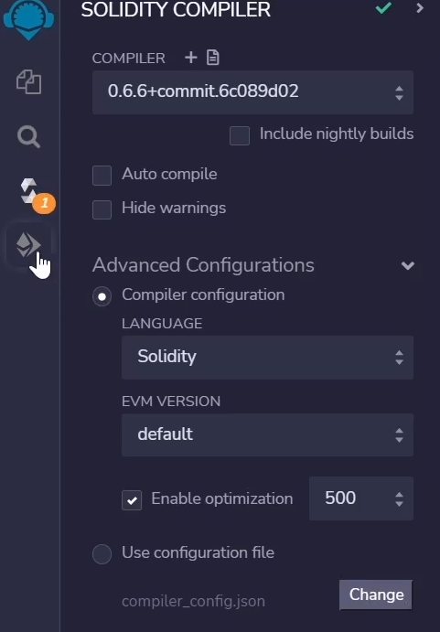
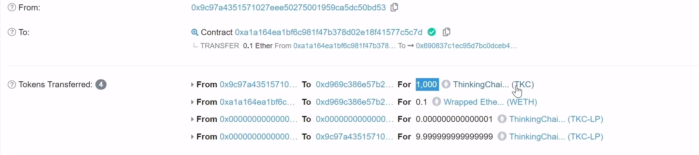

# 05.uniswap_v2_deploy

注意编译版本

- 部署Core的UniswapV2Factory合约时，需要添加一下代码

```solidity
    bytes32 public constant INIT_CODE_HASH = keccak256(abi.encodePacked(type(UniswapV2Pair).creationCode));
    //如果使用remix部署,不需要添加以下代码，因为remix有界面操作直接获取上面的变量值(INIT_CODE_HASH)
    function getInitCodeHash() public view returns(bytes32) {
        return INIT_CODE_HASH;
    }
```

- 部署UniswapV2Factory完后，会打印出INIT_CODE_HASH值，再将该值复制到UniswapV2Library.sol合约代码里（每个人每次的都不一样），如下：

```solidity
  function pairFor(address factory, address tokenA, address tokenB) internal pure returns (address pair) {
        (address token0, address token1) = sortTokens(tokenA, tokenB);
        pair = address(uint(keccak256(abi.encodePacked(
                hex'ff',
                factory,
                keccak256(abi.encodePacked(token0, token1)),
                hex'96e8ac4277198ff8b6f785478aa9a39f403cb768dd02cbee326c3e7da348845f' // init code hash
            ))));
    }
```

- 部署UniswapV2Router02合约时，需要优化编译器配置。将 Enable optimization 200 修改为 500
- 

- Core Hardat配置文件 hardhat.config.js

```js
require("@nomicfoundation/hardhat-toolbox");

const GOERLI_API_URL = "https://eth-goerli.g.alchemy.com/v2/??????????????????????";
const PRIVATE_KEY = "?????????????????????";

module.exports = {
  solidity: "0.5.16",
  settings: {
    optimizer: {
      enabled: true,
      runs: 2000,
    }
  },
  networks: {
    goerli: {
      url: `${GOERLI_API_URL}`,
      accounts: [`${PRIVATE_KEY}`]
    }
  },
};
```

- Core 部署脚本UniswapV2Factory.js

```js
const hre = require("hardhat");

async function main() {
  const [owner] = await ethers.getSigners();
  
  const UniswapV2Factory = await hre.ethers.getContractFactory("UniswapV2Factory");
  const uniswapV2FactoryContract = await UniswapV2Factory.deploy(owner.address);
  await uniswapV2FactoryContract.deployed();

  console.log(`UniswapV2Factory deployed to ${uniswapV2FactoryContract.address}`);
  const initCodeHash = await uniswapV2FactoryContract.getInitCodeHash();
  console.log("initCodeHash:",initCodeHash);

}

main()
```

- periphery MyToken.sol

```js
// SPDX-License-Identifier: MIT
pragma solidity =0.6.6;


contract MyToken  {

    event Transfer(address indexed from, address indexed to, uint value);
    event Approval(address indexed owner, address indexed spender, uint value);

    uint public totalSupply;
    mapping(address => uint) public balanceOf;
    mapping(address => mapping(address => uint)) public allowance;
    string public name = "ThinkingChain";
    string public symbol = "TKC";
    uint256 public decimals = 18;

    constructor() public {
        mintTo(msg.sender, 10000 * 10 ** 18);
    }

    function transfer(address recipient, uint amount) external returns (bool) {
        balanceOf[msg.sender] -= amount;
        balanceOf[recipient] += amount;
        emit Transfer(msg.sender, recipient, amount);
        return true;
    }

    function approve(address spender, uint amount) external returns (bool) {
        allowance[msg.sender][spender] = amount;
        emit Approval(msg.sender, spender, amount);
        return true;
    }

    function transferFrom(
        address sender,
        address recipient,
        uint amount
    ) external returns (bool) {
        allowance[sender][msg.sender] -= amount;
        balanceOf[sender] -= amount;
        balanceOf[recipient] += amount;
        emit Transfer(sender, recipient, amount);
        return true;
    }

    function mintTo(address to, uint amount) public {
        balanceOf[to] += amount;
        totalSupply += amount;
        emit Transfer(address(0), to, amount);
    }

    function mint(uint amount) external {
        balanceOf[msg.sender] += amount;
        totalSupply += amount;
        emit Transfer(address(0), msg.sender, amount);
    }

    function burn(uint amount) external {
        balanceOf[msg.sender] -= amount;
        totalSupply -= amount;
        emit Transfer(msg.sender, address(0), amount);
    }
}
```

- periphery WETH9.sol

```js

pragma solidity =0.6.6;

contract WETH9 {
    string public name     = "Wrapped Ether";
    string public symbol   = "WETH";
    uint8  public decimals = 18;

    event  Approval(address indexed src, address indexed guy, uint wad);
    event  Transfer(address indexed src, address indexed dst, uint wad);
    event  Deposit(address indexed dst, uint wad);
    event  Withdrawal(address indexed src, uint wad);

    mapping (address => uint)                       public  balanceOf;
    mapping (address => mapping (address => uint))  public  allowance;

  
    receive() external payable {
        deposit();
    }
    function deposit() public payable {
        balanceOf[msg.sender] += msg.value;
        emit Deposit(msg.sender, msg.value);
    }
    function withdraw(uint wad) public {
        require(balanceOf[msg.sender] >= wad);
        balanceOf[msg.sender] -= wad;
        msg.sender.transfer(wad);
        emit Withdrawal(msg.sender, wad);
    }

    function totalSupply() public view returns (uint) {
        return address(this).balance;
    }

    function approve(address guy, uint wad) public returns (bool) {
        allowance[msg.sender][guy] = wad;
        emit Approval(msg.sender, guy, wad);
        return true;
    }

    function transfer(address dst, uint wad) public returns (bool) {
        return transferFrom(msg.sender, dst, wad);
    }

    function transferFrom(address src, address dst, uint wad)
        public
        returns (bool)
    {
        require(balanceOf[src] >= wad);

        if (src != msg.sender && allowance[src][msg.sender] != uint(-1)) {
            require(allowance[src][msg.sender] >= wad);
            allowance[src][msg.sender] -= wad;
        }

        balanceOf[src] -= wad;
        balanceOf[dst] += wad;

        emit Transfer(src, dst, wad);

        return true;
    }
}
```

addLiquidityETH：

第一次添加流动性的时候，需要扣留MINIMUM_LIQUIDITY


