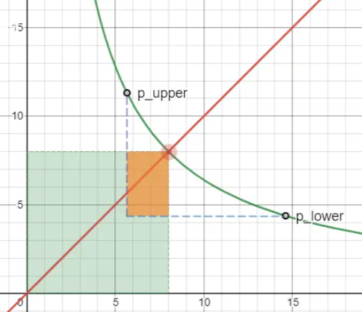
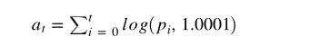

# uniswap_v3_theory

## V3的改进

1. 提高资金利用率（集中流动性），增加LP深度
2. 增强价格预言机的方便性和准确性
3. 灵活的手续费收取机制（0.05%，0.3%，1%），比如：处理价格波动较大时无常损失很多，补偿LP；价格波动小的少收手续费

## 集中流动性

在V2版本，理论上池子中的token的价格区间是(0, ∞)，我无论投入多少钱（和流动性等比例添加流动性），都可以得到手续费分成：即使我投入1USDT和1ETH（假设价格是1：1），也能得到分成，但是平摊之后按照份额我得到的手续费分成微乎其微，因为我的1USDT和1ETH占总额极小。但我们一定可以分到钱。

无论如何都可以分到钱，这听起来很美好，但我们忽略了一个问题：资金利用率。

### 问题所在

- 在V2中，当一个用户来用我们的池子做交易时，其交易的量相比我们的流动性来说是很小的。
  - 举个例子
    - 假设现在池子内资产 X 和 Y 都有 8 个，价格 p 为 1。
    - 现在有一笔订单，用 1 个 X 来换取 1 个 Y，我们先不考虑滑点和手续费的影响，这一笔交易为我们带来的手续费收益是 `fee = 1 * 0.3%`，实际参与赚取手续费的流动性就是输出的 1 个 y，这相比于总流动性是很小的，在这一笔交易中，资金利用率是大约是 `1 / 8`。
    - 也就是说，我们只需要极少一部分流动性就能承载这一笔交易，而大部分流动性在交易过程中只是躺在那做收益的分母而已
  - 图像表示
    - 当用户用 X 换取 Y 的时候，价格会从低点涨到高点，红点从 `p_lower` 移动到 `p_upper` 的过程中（X 的价格），实际参与交易的流动性仅仅是橙色的矩形区域。（这里为了便于查看，夸大了价格的变动区间，实际交易过程中，价格变动不会这么大，所以橙色区域是极小的）
    - 

### 解决问题

V3为了解决资金利用率低下的问题，引入了集中流动性的概念：因为实际的价格不可能在(0, ∞)，只会在一个小范围内，因此我们可以将曲线进行移动，因此实际的曲线我们设置成下图这样。并且我们做到了资金利用率是100%，因为橙色的区域就是K值，不存在绿色的区域。


但是如果模型搞成这样，就不是反比例了，和V2的模型就不一样。为了V3和V2普通用户进行交易的时候体验相同，V3引入虚拟流动性的概念：将上图的曲线进行平移抬升，恢复到V2的模型，效果下图。注意：我们这样平移对价格没有影响，前提是价格没有超过限定的区间。


- 特点

  - 在 Uniswap V3 中，允许用户在提供流动性时，可以自定义该流动性所支持的价格区间，仅当交易价格处于指定的交易区间内时，提供的头寸（position：集中到一个有限区间的流动性）才会被激活，V3 会注入虚拟流动性来保持公式的计算一致性，使曲线从橙色曲线拉抬成了青色曲线，用户才能够分得手续费。注意， `x_virtual`, `y_virtual` 并不会参与真实的交易

  - 当流动池的价格来到用户设置的零界点时（例如图中的 a 点或者 b 点），用户实际提供的 x token 或者 y token 将为 0，x 或 y 将完全由虚拟 token 组成。为了保证虚拟 token 恒定不变，当价格进一步变动，移动到用户设定的价格区间之外时，流动池会移除这部分流动性，以保证虚拟的 x token 或 y token 数量不会减少，因此这部分虚拟的 token 只会在价格处于设定的区间内时参与价格的计算，而不会真的参与流动性提供（即虚拟 token 数为常数，并不会发生数量变化）。例如，当价格到达 a 点时，用户的所有资金转换为 x，此时Yreal=0, y=Yv，当价格继续降低时，流动池将移除这部分流动性。用户的资金状态将停留在 a 点，直至价格再次回到 a 点并进入 a,b 价格区间。

    

- 市场

  - 如此一来，理想状态下，由于每个用户对币价的预期不同，大家都会选择自认为流动性较大的区间做市，提高了头寸的资金利用率，获得更多的手续费收益。当然，你设置的区间越小，在区间添加的流动性越多，得到的回报就更多，如何根据区间范围和流动性添加多少而进行分配手续费的规则很复杂，下面会另外说。可以类比炒股：只压其中一个股票=V3定义的区间很小，压很多钱到其中一个股票=V3流动性添加很多。
  - V3 的改变，相当于是给用户提供了一种高风险高回报的收益模式。当然，如果用户对市场趋势判断的信心不足，愿意降低收益的同时降低风险（类似买基金，不买股票），也可以将提供头寸的流动性区间手动设置为 (0, ∞) ，如此一来，风险收益模型就和 V2 没有区别了。

### 公式推导

有了这个解决方案，我们就来考虑如何用数学来实现它。公式如下：

```
(x + x_virtual) * (y + y_virtual) = L^2

注：由于后面的相关交易公式推导涉及到了开根号，所以为了方便计算，V3 使用了 L^2 来替代 k ，实质上两者是一样的（L^2 = k）。
```

下图是公式的推导（1）和公式的例子（2）


我们来研究一下：当价格大于、小于、位于范围区间时的Xreal与流动性的关系。


### 流动性聚合

> 问题摘要：
>
> 假如我设置流动性区间是100~200，有人设置区间110~200，此时价格为150，我们添加的流动性都可以获得手续费。
> 此时有人swap了1个ETH，那么我们可以来分这个手续费，它是怎么计算手续费分成给每个人的呢？
> 如果是以前V2，就很容易理解，个人份额占总份额。但是在V3，每个人在不同区间有份额，它怎么计算每个人应该分到多少呢？

上面我们说了，通过引入虚拟 token 的概念，让用户可以在某一个价格区间内提供流动性。而每一个用户提供的流动性都可能设置不同的价格区间，这样一来一个交易对的池子中就包含了多个不同的流动性

因此从单个交易池的视角来看：Uniswap v3 实际上扮演的角色是一个交易聚合器：当发生交易时，此交易会拆分成多个，通过池中多个不同的流动性区间来进行交易，最后将交易结果聚合，完成最终的交易过程。

从交易聚合器的角度看：在交易发生前，池中每一个流动性区间中的 token price 是一致的（每一个区间是均匀分配流动性的）。那么我们需要让交易结束后，池中每一个流动性中的 token price 仍然是一致的（当然这里仅包含所有在区间内的流动性）。因此 v3 的交易过程会围绕价格来进行，这样可以保证所有流动性的价格一致。事实上这就和 AMM 交易聚合器的行为一致，因此我们可以把 Uniswap V3 理解成单个交易池中不同流动性的交易聚合器。

在实际交易过程中，一个交易会通过多个流动性聚合完成。因此下面的公式会进行聚合完成，即使用当前价格上的流动性总和来进行计算，也就是说 `整体流动性 = 各个用户的流动性聚合的结果`


同时，一个交易还可能跨越不同的流动性阶段（即可能超出或者进入某个流动性），因此合约需要维护每个用户提供流动性的价格边界，当价格到达边界时，需要在总流动性上增加或移除对应流动性大小，通过分段计算的方式完成交易结果的计算。

> 在 V2 中代表用户提供了流动性的凭证是 ERC20 类型的 LP token （liquidity provider token），因为所有流动性都可以被认为是价格区间为 (0, ∞) 的流动性，因此可以用同质化代币流通。但 V3 中每个流动性可能价格区间都不同，因此需要用 ERC721 类型（NFT）的非同质化代币表示。

注意：V3中是用ERC721来表示流动性的，而不是ERC20

### 流动性计算

假设用户提供的流动性范围：[Pa, Pb]

- 如果池子价格Pc < Pa


- 如果池子价格Pc > Pa


- 如果池子价格Pc位于你设置的价格区间内


## 池子

下面有三个模型：

- 第一个：V2中的流动性是平摊到(0, ∞)
- 第二个：V3规定可以指定在某一个范围提供流动性，你注入的流动性在这个范围内均匀分布
- 第三个：一个交易对池子的流动性注入区间的情况累加而成。注意：如图只是举个例子，真实情况不一定就是正态分布


池子的交易过程如下图：假设我们的价格从低去往高处，于是就会从左向右穿过这些区间1、2、3，不断用一种资产换另外一种资产。如果价格区间的某种资产被消耗完了，就会进入下一个区间。在价格移动消耗池内资产数量的过程中，输入的资产数量也会不断减少，一旦在某个区间输入资产被耗尽，那么价格就会停留在该区间内。

停留在该区间具体什么位置，V3有自己的公式进行计算，它引入了tick的概念，通过tick的计算来确定价格停留在哪个具体位置。


## tick

1. 我们将价格轴划分为有限个离散的点，交易价格的区间边界只能定义在这些点`i`上面，这里的 `i` 也就是价格的序号，我们称之为 `tick`，而由所有序号组成的集合称之为 `Ticks`。在合约代码中，主要是以 `tick` 来记录流动性的区间。

2. tick的位置如何呢？

   - 按照等差数列间隔：solidity不支持小数，我们对这些等差元素进行编号，比如 0.0001 是 1 号， 0.0002 是 2 号...但是，因为 solidity 最大的整数是 `2^256`，大约在 `1.158e73` 的价格就到头了。并且不具备灵活性，只能0.0001。不可行。

   - 按照等比数列间隔：问题和等差的差不多，价格范围小，不具备灵活性

   - 按照等幂数列间隔

     - i越小，波动越小，点与点之间的间隔越小，价格差越小；i越大，波动越大，点与点之间的间隔大，价格差越大。这就非常适合稳定币和波动大的山寨币了

     - i的类型是int24。i=0的时候，价格是1，是价格的基点。可以是负数，那就是在0~1之间波动，正数则逐步变大。

     - 在 V3 中的价格是从 `(√1.0001)^(int24).min` 到 `(√1.0001)^(int24).max` ，这是一个足够宽广的价格区间，且满足交易中的精度要求。

       

### 费率设计

- 我们知道 `tick` 越多，价格可选的值越精细，但是合约在计算时候的价格区间就可能越多，那么 gas 消耗也会更加的多，因此我们需要让 `tick` 的数量保持在一个合理的范围内。Uniswap 针对不同类型的代币对推荐使用不同类型的费率，引入了 `tickSpacing` 的概念，即每个 `tick` 之间跳过 N 个 `tick`。
  - 对于价格波动较小的交易池，我们希望 `tickSpacing` 更小，这样价格可选值更多，同时也希望费率更低。反之波动大的交易对，可以让 `tickSpacing` 更大，这样更节约 gas，但是我们希望它的费率更高。
  - 对于每一种交易对而言，都有三档可选费率等级，0.05%, 0.3%, 1%，并且以后通过社区治理，还有可能永久增加可选的挡位。每种交易费率等级都由给定的 `tickspacing`，比如稳定币交易对，就是 `tick` 之间需要间隔 10 个才是有效的可使用的 tick 。位于间隔内的 `tick` 虽然存在，但程序不会去初始化和使用，也就不会产生 gas 费用。因此，我们在等幂数列的基础上，进一步节省了计算消耗。

V3 设定的费率等级：

| 费率  | tickspacing | 建议的使用范围   |
| ----- | ----------- | ---------------- |
| 0.05% | 10          | 稳定币交易对     |
| 0.3%  | 60          | 适用大多数交易对 |
| 1%    | 200         | 波动极大的交易对 |

### liquidityNet和liquidityGross

- 定义

  - `liquidityGross`：如下图，当有流动性区间的边界设置为1、2、3点时，`liquidityGross` 都会增加。如果某个tick的`liquidityGross`为0，说明这个点没有激活，没有流动性

  - `liquidityNet`：表示当价格穿过该 tick 时，处于激活的流动性需要变化的数量。如图，穿过1、2、3这些tick时，会根据这些tick上面的`liquidityNet`更新处于激活状态的流动性数量。在注入或移除数量为 `l` 的流动性时，具体规则如下：

    - 注入流动性，tick 是价格下限，`liquidityNet` 增加 `l`
    - 注入流动性，tick 是价格上限，`liquidityNet` 减少 `l`
    - 移除流动性，tick 是价格下限，`liquidityNet` 减少 `l`
    - 移除流动性，tick 是价格上限，`liquidityNet` 增加 `l`

    

- 例子

  - liquidityGross

    

  - liquidityNet


### 手续费

- 分配手续费的标准：在任意区间内，根据出资比例和参与时长保证分配的公平性

- 方案1：直接累加手续费（淘汰）

  - 算法
    1. 一笔交易开始，根据之前交易部分的过程描述，交易会在已有流动性的 tick 之间，逐个进行
    2. 当价格来到一个 tick (已有流动性的tick)，我们只要记录这个 tick 上的交易量，根据费率算出该区间的总手续费
    3. 然后找出所有包含该 tick 流动性头寸 `position`，先将他们的数量汇总
    4. 再根据出资比例逐个分配手续费，将数值累加到待每个头寸的待收取手续费的变量上
  - 缺点：十分消耗gas。原因：一笔交易可能会横跨很多个 tick ，单就一个 tick 的计算，就有可能涉及到非常多的流动性头寸 `position`，这不但需要一个耗时的遍历查找的过程，更严重的问题是，每个流动性头寸的待收取手续费肯定是一个 storage 变量，当我们去逐个写入新的数值的时候，gas 费用就起飞了。

- 方案2：（pick）

  - 相同区间 position 之间的分配

    - 算法

      1. 我们不去遍历，而是计算每单位流动性能够获取的手续费数量：`用户提供流动性的数量 * 每单位流动性的手续费 = 应得的手续费`。`每单位流动性的手续费 = 总手续费 / 总流动性`。

      2. 我们设置一个记录全局的每单位流动性赚取手续费的累计值 `feeGrowthGlobal` （注意有 growth，表示它是累计值）。

         - `feeGrowthGlobal`: 每当有交易发生，就会把每单位流动性赚取的手续费累加到该变量上，这是一个随时间推移单调递增的变量。（这个变量其实有两个，因为手续费的收取是两种资产分别收取的，所以累计的变量也对应了两个）

         - `liquidity`: 池子当前处于激活状态的总流动性数量。

      3. 再设置一个局部变量：`delta fee`: 交易过程中，每一步产生的手续费数量

      4. 我们只需要用 `delta fee` 除以 `liquidity` 就能得到 `feeGrowthGlobal` 每次需要增加的量。

      5. 只需要在流动性发生变化时，计算这段时间内 `feeGrowthGlobal` 的增量，再乘以该 `position` 的流动性数量，就可以知道这段时间内该 `position` 收取的手续费增量。

      6. 最后将 `position` 内手续费的增量累加起来就是它应得的数量。

    - 特点

      - 不需要遍历流动性数量算出流动性数量比例，而是去关注每单位收益的增量
      - 在 `position` 流动性数量发生变化之前，需要将之前这段时间的手续费增量计算出来，累加记录到相关变量中
      - 全局的 `feeGrowthGlobal` 是会随着交易进行实时更新的，而 `position` 中的手续费数量不会实时更新，只会在调用 mint 和 burn 这两个会改变流动性数量的函数时触发更新。

  - 不同区间之间的分配

    - 算法

      1. 计算区间外的手续费数量，用总手续费减去区间外的手续费数量，间接知道区间内的手续费

         > 假如交易在一个 (a,b) 的价格区间内进行，手续费会在区间内不断累加，但是区间外是一直不变的，即 (0, a) 和 (b, ∞) 区间内的手续费并没有增加。想要计算 (a,b) 区间内的手续费，其实只要用池子内所有流动性赚取的总手续费数量减去区间两边外侧的手续费就行了

         

      2. 公式：`feeGrowthInside = feeGrowthGlobal - feeGrowthOutsideBelow - feeGrowthOutsideAbove`。feeGrowthOutsideBelow 是红框的左侧，feeGrowthOutsideAbove是红框的右侧。

      3. 如果以某个 tick 作为中轴，价格点所在的一侧是内侧，而相对的另一侧是外侧。于是触发其更新的条件其实只有一个：当价格穿过该 tick 时（不论方向左右）。因为只有此时，tick 左右两侧会互换内侧和外侧的定义。

  - 总流程

    1. 记录池子内全局的每单位流动性收取手续费的数量的累加变量 `feeGrowthGlobal`
    2. 在每个有流动性的 tick 上记录外侧的手续费数量 `feeGrowthOutside`
    3. 对于任意区间，利用公式计算出区间内的手续费总量 `feeGrowthInside`
    4. 该区间内会存在不同用户注入的不同流动性头寸 `position`，在 `position` 流动性数量发生变化时，累加距离上次变化到现在这段时间的手续费数量增量到 `tokensOwed` 变量（该 positioin 总共可回收的流动性数量）
    5. 用户收取手续费，从 `tokensOwed` 中扣除，其他变量不受影响。

### 辅助预言机的数据

| Type   | Variable Name                  | 含义                                  |
| ------ | ------------------------------ | ------------------------------------- |
| int128 | liquidityNet                   | 流动性数量净含量                      |
| int128 | liquidityGross                 | 流动性数量总量                        |
| int256 | feeGrowthOutside0X128          | 以 token0 收取的 outside 的手续费总量 |
| int256 | feeGrowthOutside1X128          | 以 token1 收取的 outside 的手续费总量 |
| int256 | secondsOutside                 | 价格在 outside 的总时间               |
| int256 | tickCumulativeOutside          | 价格在 outside 的 tick 序号累加       |
| int256 | secondsPerLiquidityOutsideX128 | 价格在 outside 的每单位流动性参与时长 |

1. `secondsOutside`： 用池子创建以来的总时间减去价格区间两边 tick 上的该变量，就能得出该区间做市的总时长
2. `tickCumulativeOutside`： 用预言机的 `tickCumulative` 减去价格区间两边 tick 上的该变量，除以做市时长，就能得出该区间平均的做市价格（tick 序号）
3. `secondsPerLiquidityOutsideX128`： 用预言机的 `secondsPerLiquidityCumulative` 减去价格区间两边 tick 上的该变量，就是该区间内的每单位流动性的做市时长（使用该结果乘以你的流动性数量，得出你的流动性参与的做市时长，这个时长比上 1 的结果，就是你在该区间赚取的手续费比例）。

## 无常损失

相同条件下，相同点，在V2和V3添加相同流动性的无常损失情况对比，可以看出，V3的无常损失比V2大


V3无常损失移动的三种情况：移动到范围内、移动到大于范围、移动到小于范围，并且验证当范围无限大的时候是否变成V2：


## 限价单

当[a,b]区间足够小，即a,b足够接近时，可以在较短的时间内将X资产全部兑换为Y资产；通过做市的方式类似达到了限价单的功能，但是这个兑换只是暂时的，如果价格返回原点，Y资产会被兑换回X资产，所以需要流动性提供者在完成兑换后取出流动性。

其实区间范围大了也是一个道理，反正原理就是：当从一个价格移动向另外一个价格的时候，一种资产全部转变为另外一种资产。举个例子，我在[5,6]价格区间注入了5USDT和0DAI的流动性，然后价格从4去到了8，那么我注入的5USDT就会全部转变为n个DAI。过程类似下图：


## 预言机

### 新旧对比

- V2 的预言机提供了 TWAP (time-weighted average price 时间加权平均价格)，更新时间是每个区块的第一笔交易的价格，其数值是上一次的数值加上当前价格乘以时间差。外部用户可以通过记录该数值的变化和时间点，获得在一段时间内受短期波动影响较小的时间加权价格。
- V2 的预言机在核心合约上只保留最新的一个值，所以如果外部用户想要使用这个预言机，需要自己搭建一套监控和记录的设施，增加了使用者成本。

V3 相比于 V2 的预言机，有以下较大改动：

- 相比 V2 累加的是价格的加权数值，V3 累加的是价格的 log 值，即 `log(price, 1.0001)`
- 在核心合约中增加了存储预言机数值的空间，最大 65536 个数值，至少 9 天的数值，建立监控和记录设施不再是必要条件
- 增加关于流动性的预言机数值，记录周期和价格一致（每个区块的第一笔交易），其值是当前激活状态的流动性数量的倒数，即 `1/liquidity`

### 公式

- V2 使用算术平均：记录价格的累加值，而使用时再除以时间间隔。而 V3使用几何平均： 累加`log(price, 1.0001)` ，也就是价格的幂，使用时再除以时间间隔

- V3的公式

  

  > 这里的 log 数值后面其实还有一个 `* 1s` 即以每秒作为时间间隔。然而实际情况中，合约中是以区块的时间戳作为标记时间的，所以合约中的代码跟公式不同。每个区块的头一笔交易时更新，此时距离上一次更新时间间隔肯定大于 1s，所以需要将更新值乘以两个区块的时间戳的差。`tickCumulative` 是 tick 序号的累计值，tick 的序号就是 `log(√price, 1.0001)`。

- 相比于 V2，任何时刻活跃的流动性就是池子内所有流动性数量总和（因为都是全价格区间），V3 有了不同价格区间，所以不同时刻，激活状态的流动性数量并不是池子内的总流动性数量。为了便于外部使用者更好的观测激活流动性的数量，V3 添加了预言机的 `secondsPerLiquidityCumulative` 变量。


## 风险与收益

- 虽然V3的资产利用率更高，但V3的无常损失更大
- 由于添加流动性是指定一个区间，如果指定的区间太小导致价格不位于区间内，那么你添加的流动性不会被激活，因此赚不到任何手续费；但是如果区间太大比如设置为无穷，那就和V2没区别，资金利用率太低，导致手续费平摊到你手上的钱极少


参考

- https://mirror.xyz/0xCf19c7444b775f4fede9b7B53b4d708338004aa4/vC-wd8t-Z2cXdpV3jKQsagoGHrRNMRAp-LDPISQ71CA
- https://www.bilibili.com/video/BV1uq4y1N7o6/?vd_source=0cc0401ee122346d6680e90658b0ed1a
- https://www.learnblockchain.cn/article/3055
- https://davidc.ai/2021/12/21/%E6%B5%85%E6%9E%90-Uniswap-V3/
- https://mirror.xyz/adshao.eth/tgZjDXOtL999iuPjXWrolR7Ns1nTZDADA6NLJaJpJJM
- https://paco0x.org/uniswap-v3-1/
