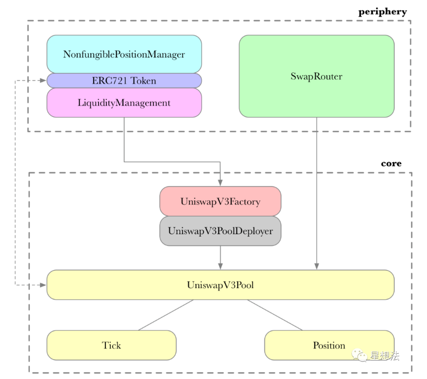
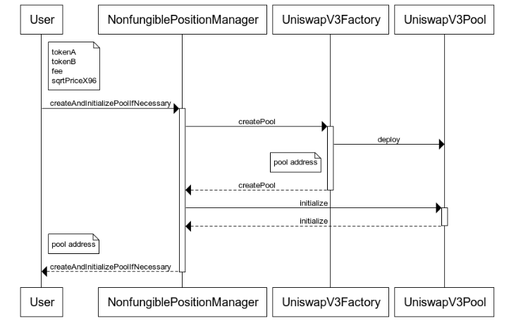
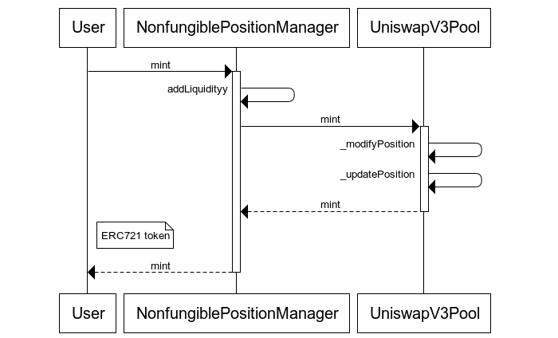
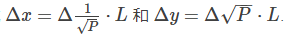
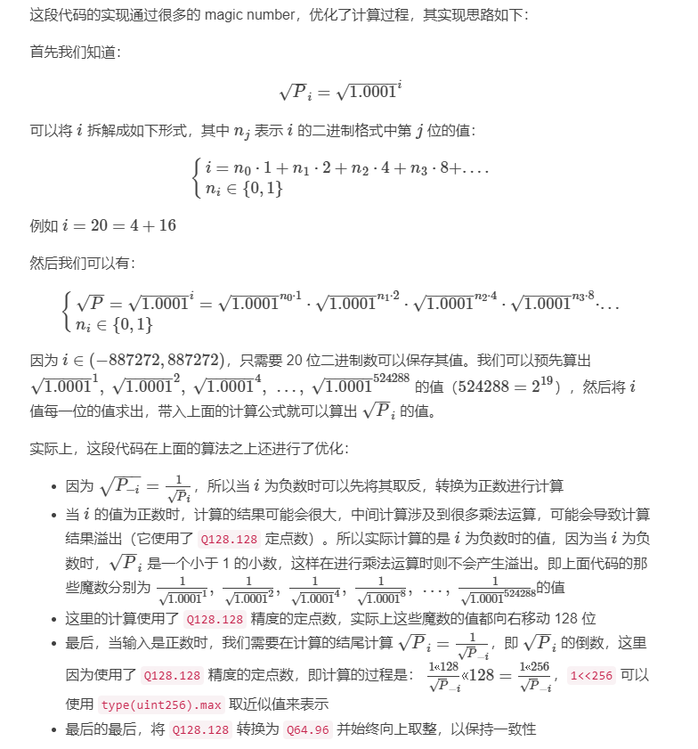
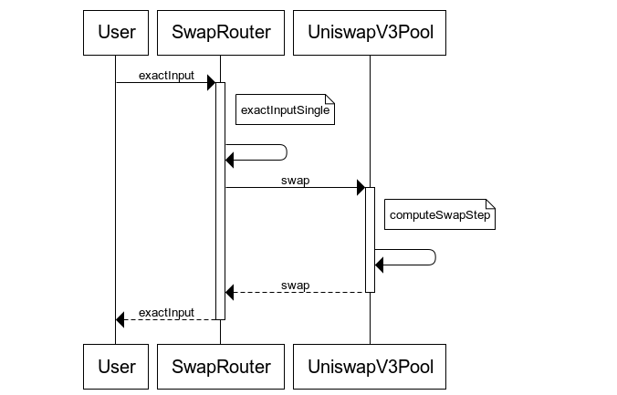
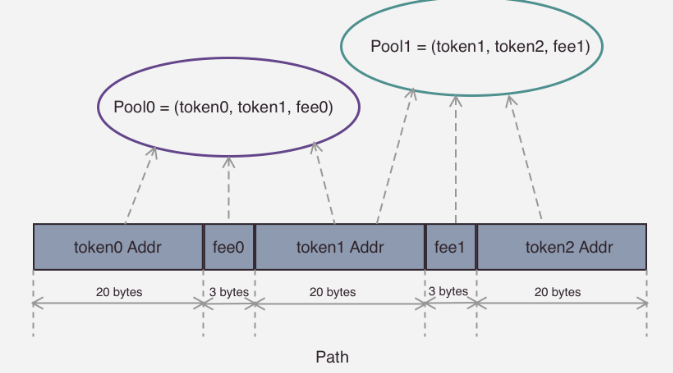
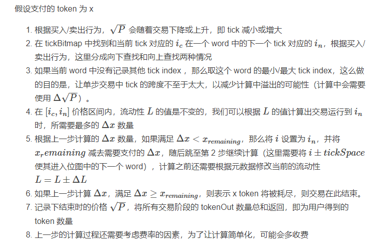
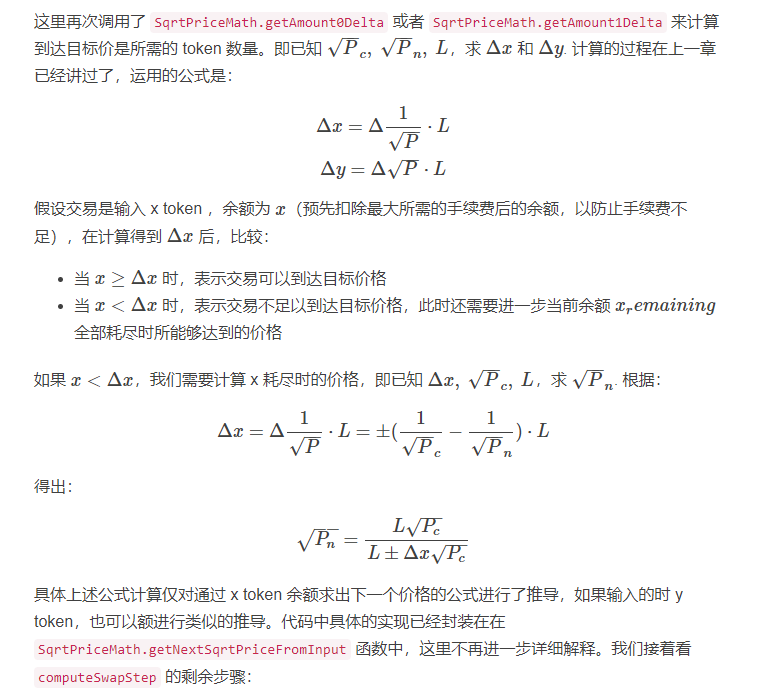
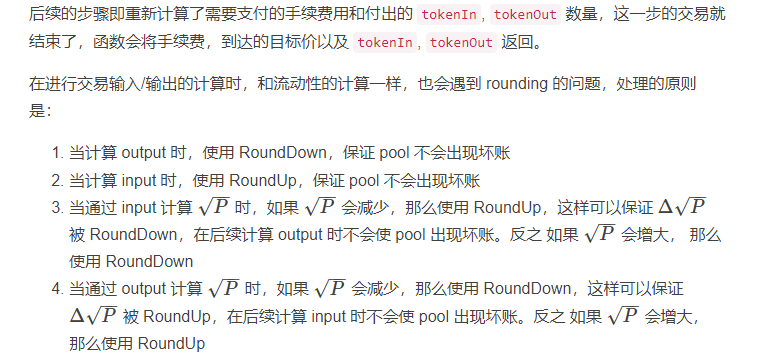

# uniswap_v3_code

声明：转载自此[大佬](https://paco0x.org/uniswap-v3-2/#%E4%BB%8E-token-%E6%95%B0%E8%AE%A1%E7%AE%97%E6%B5%81%E5%8A%A8%E6%80%A7-l)。

## 代码架构

Uniswap v3 在代码层面的架构和 v2 基本保持一致，将合约分成了两个仓库：

- [uniswap-v3-core](https://github.com/Uniswap/uniswap-v3-core)
  - UniswapV3Factory：提供创建 pool 的接口，并且追踪所有的 pool
  - UniswapV3Pool：实现代币交易，流动性管理，交易手续费的收取，oracle 数据管理等，相当于V2的pair
- [uniswap-v3-periphery](https://github.com/Uniswap/uniswap-v3-periphery)
  - SwapRouter：提供代币交易的接口，它是对 UniswapV3Pool 合约中交易相关接口的进一步封装，前端界面主要与这个合约来进行对接
  - NonfungiblePositionManager：用来增加/移除/修改 Pool 的流动性，并且通过 NFT token 将流动性代币化。使用 ERC721 token（v2 使用的是 ERC20）的原因是同一个池的多个流动性并不能等价替换（v3 的集中流性动功能）。



## 创建交易对



1.调用NonfungiblePositionManager合约的父合约PoolInitializer的`createAndInitializePoolIfNecessary()`方法。

```solidity
function createAndInitializePoolIfNecessary(
        address token0,
        address token1,
        uint24 fee,
        uint160 sqrtPriceX96
    ) external payable override returns (address pool) {
    	// 排序token
        require(token0 < token1);
        // 查看池子是否已经创建过了
        // getPool的数据类型：mapping(address => mapping(address => mapping(uint24 => address))) public override getPool;
        // 使用 3个 map 说明了 v3 版本使用 (tokenA, tokenB, fee) 来作为一个交易对的键，即相同代币，不同费率之间的流动池不一样。
        pool = IUniswapV3Factory(factory).getPool(token0, token1, fee);

		// 如果还没创建，则创建新的池子
        if (pool == address(0)) {
            pool = IUniswapV3Factory(factory).createPool(token0, token1, fee);
            // 池子进行初始化
            IUniswapV3Pool(pool).initialize(sqrtPriceX96);
        } else {
            (uint160 sqrtPriceX96Existing, , , , , , ) = IUniswapV3Pool(pool).slot0();
            if (sqrtPriceX96Existing == 0) {
                IUniswapV3Pool(pool).initialize(sqrtPriceX96);
            }
        }
    }
```

2.进入到UniswapV3Factory合约的`createPool()`

```solidity
    function createPool(
        address tokenA,
        address tokenB,
        uint24 fee
    ) external override noDelegateCall returns (address pool) {
        require(tokenA != tokenB);
        (address token0, address token1) = tokenA < tokenB ? (tokenA, tokenB) : (tokenB, tokenA);
        require(token0 != address(0));
        int24 tickSpacing = feeAmountTickSpacing[fee];
        require(tickSpacing != 0);
        require(getPool[token0][token1][fee] == address(0));
        pool = deploy(address(this), token0, token1, fee, tickSpacing);
        getPool[token0][token1][fee] = pool;
        // populate mapping in the reverse direction, deliberate choice to avoid the cost of comparing addresses
        getPool[token1][token0][fee] = pool;
        emit PoolCreated(token0, token1, fee, tickSpacing, pool);
    }
```

3.创建池子其实是到UniswapV3PoolDeployer合约进行实际的部署，可以看到是用CREATE2来部署的。因为是CREATE2部署的，因此我们可以在链下[提前计算出来池子的地址](https://github.com/Uniswap/v3-periphery/blob/3514c56ccf84a2d32b623004e7c119494ac729cc/contracts/libraries/PoolAddress.sol#L15-L38)。

```solidity
    function deploy(
        address factory,
        address token0,
        address token1,
        uint24 fee,
        int24 tickSpacing
    ) internal returns (address pool) {
        parameters = Parameters({factory: factory, token0: token0, token1: token1, fee: fee, tickSpacing: tickSpacing});
        // 
        pool = address(new UniswapV3Pool{salt: keccak256(abi.encode(token0, token1, fee))}());
        delete parameters;
    }
```

4.池子合约的构造函数如下。

疑问：为什么不直接使用参数传递来对新合约的状态变量赋值呢？原因：CREATE2使用initcode和salt进行创建合约，而initcode是写死的，构造器的参数是拼接到initcode后面的，因此无法拼接构造器参数，否则每个池子的参数都是一样的。相反，如果是使用UniswapV3Factory合约的参数，则可以动态改变参数。

```solidity
    constructor() {
        int24 _tickSpacing;
        // 反向查询 `UniswapV3Factory` 中的 parameters 值来进行初始变量的赋值。
        (factory, token0, token1, fee, _tickSpacing) = IUniswapV3PoolDeployer(msg.sender).parameters();
        tickSpacing = _tickSpacing;

        maxLiquidityPerTick = Tick.tickSpacingToMaxLiquidityPerTick(_tickSpacing);
    }
```

5.最后完成初始化工作：此时池子中还没有流动性

```solidity
    function initialize(uint160 sqrtPriceX96) external override {
        require(slot0.sqrtPriceX96 == 0, 'AI');

        int24 tick = TickMath.getTickAtSqrtRatio(sqrtPriceX96);

        (uint16 cardinality, uint16 cardinalityNext) = observations.initialize(_blockTimestamp());
		// 设置tick，初始价格费率等
        slot0 = Slot0({
            sqrtPriceX96: sqrtPriceX96,
            tick: tick,
            observationIndex: 0,
            observationCardinality: cardinality,
            observationCardinalityNext: cardinalityNext,
            feeProtocol: 0,
            unlocked: true
        });

        emit Initialize(sqrtPriceX96, tick);
    }
```

## 提供流动性

### 整体流程

在合约内，v3 会保存所有用户的流动性，代码内称作 `Position`，提供流动性的调用流程如下：



用户首先和 `NonfungiblePositionManager` 合约交互，v3 这次将 LP token 改成了 ERC721 token，并且将 token 功能放到 `NonfungiblePositionManager` 合约中。这个合约替代用户完成提供流动性操作，然后根据将流动性的数据元记录下来，并给用户铸造一个 NFT Token.

1.首先调用NonfungiblePositionManager合约的`mint()`

```solidity
    function mint(MintParams calldata params)
        external
        payable
        override
        checkDeadline(params.deadline)
		.........
        IUniswapV3Pool pool;
        (liquidity, amount0, amount1, pool) = addLiquidity(
            AddLiquidityParams({
                token0: params.token0,
                token1: params.token1,
                fee: params.fee,
                recipient: address(this),
                tickLower: params.tickLower,
                tickUpper: params.tickUpper,
                amount0Desired: params.amount0Desired,
                amount1Desired: params.amount1Desired,
                amount0Min: params.amount0Min,
                amount1Min: params.amount1Min
            })
        );

        _mint(params.recipient, (tokenId = _nextId++));
		.........
    }
```

2.进入`addLiquidity()`：

- 传入的 lower/upper 价格是以 tick index 来表示的，因此需要在链下先计算好价格所对应的 tick index
- 传入的是流动性 L的大小
- 这里有一个回调函数的参数，v3 使用回调函数来完成进行流动性 token 的支付操作，

```solidity
struct AddLiquidityParams {
    address token0;     // token0 的地址
    address token1;     // token1 的地址
    uint24 fee;         // 交易费率
    address recipient;  // 流动性的所属人地址
    int24 tickLower;    // 流动性的价格下限（以 token0 计价），这里传入的是 tick index
    int24 tickUpper;    // 流动性的价格上线（以 token0 计价），这里传入的是 tick index
    uint128 amount;     // 流动性 L 的值
    uint256 amount0Max; // 提供的 token0 上限数
    uint256 amount1Max; // 提供的 token1 上限数
}

function addLiquidity(AddLiquidityParams memory params)
    internal
    returns (
        uint256 amount0,
        uint256 amount1,
        IUniswapV3Pool pool
    )
{
    PoolAddress.PoolKey memory poolKey =
        PoolAddress.PoolKey({token0: params.token0, token1: params.token1, fee: params.fee});

    // 这里不需要访问 factory 合约，可以通过 token0, token1, fee 三个参数计算出 pool 的合约地址
    pool = IUniswapV3Pool(PoolAddress.computeAddress(factory, poolKey));

    (amount0, amount1) = pool.mint(
        params.recipient,
        params.tickLower,
        params.tickUpper,
        params.amount,
        // 这里是 pool 合约回调所使用的参数
        abi.encode(MintCallbackData({poolKey: poolKey, payer: msg.sender}))
    );

    require(amount0 <= params.amount0Max);
    require(amount1 <= params.amount1Max);
}
```

3.进行UniswapV3Pool的`mint()`，其中调用了`_modifyPosition()`和`ModifyPositionParams()`获得一些参数。这一步做了很多操作，见具体过程分析。

```solidity
function mint(
    address recipient,
    int24 tickLower,
    int24 tickUpper,
    uint128 amount,
    bytes calldata data
) external override lock returns (uint256 amount0, uint256 amount1) {
    require(amount > 0);
    (, int256 amount0Int, int256 amount1Int) =
        _modifyPosition(
            ModifyPositionParams({
                owner: recipient,
                tickLower: tickLower,
                tickUpper: tickUpper,
                liquidityDelta: int256(amount).toInt128()
            })
        );

    amount0 = uint256(amount0Int);
    amount1 = uint256(amount1Int);

    uint256 balance0Before;
    uint256 balance1Before;
    // 获取当前池中的 x token, y token 余额
    if (amount0 > 0) balance0Before = balance0();
    if (amount1 > 0) balance1Before = balance1();
    // 将需要的 x token 和 y token 数量传给回调函数，这里预期回调函数会将指定数量的 token 发送到合约中
    IUniswapV3MintCallback(msg.sender).uniswapV3MintCallback(amount0, amount1, data);
    // 回调完成后，检查发送至合约的 token 是否复合预期，如果不满足检查则回滚交易
    if (amount0 > 0) require(balance0Before.add(amount0) <= balance0(), 'M0');
    if (amount1 > 0) require(balance1Before.add(amount1) <= balance1(), 'M1');

    emit Mint(msg.sender, recipient, tickLower, tickUpper, amount, amount0, amount1);
}
```

4.进入回调函数`uniswapV3MintCallback()`。

使用回调函数原因：将 `Position` 的 owner 和实际流动性 token 支付者解耦。这样可以让中间合约来管理用户的流动性，并将流动性 token 化。关于 token 化，Uniswap v3 默认实现了 ERC721 token（因为即使是同一个池子，流动性之间差异也也很大）。

例如，当用户通过 `NonfungiblePositionManager` 来提供流动性时，对于 `UniswapV3Pool` 合约来说，这个 `Position` 的 owner 是 `NonfungiblePositionManager`，而 `NonfungiblePositionManager` 再通过 NFT Token 将 `Position` 与用户关联起来。这样用户就可以将 LP token 进行转账或者抵押类操作。

```solidity
struct MintCallbackData {
    PoolAddress.PoolKey poolKey;
    address payer;         // 支付 token 的地址
}

/// @inheritdoc IUniswapV3MintCallback
function uniswapV3MintCallback(
    uint256 amount0Owed,
    uint256 amount1Owed,
    bytes calldata data
) external override {
    MintCallbackData memory decoded = abi.decode(data, (MintCallbackData));
    CallbackValidation.verifyCallback(factory, decoded.poolKey);

    // 根据传入的参数，使用 transferFrom 代用户向 Pool 中支付 token
    if (amount0Owed > 0) pay(decoded.poolKey.token0, decoded.payer, msg.sender, amount0Owed);
    if (amount1Owed > 0) pay(decoded.poolKey.token1, decoded.payer, msg.sender, amount1Owed);
}
```

5.最后在NonfungiblePositionManager再次`mint()`，铸造流动性NFT

```solidity
function mint(MintParams calldata params)
    external
    payable
    override
    checkDeadline(params.deadline)
    returns (
        uint256 tokenId,
        uint256 amount0,
        uint256 amount1
    )
{
    IUniswapV3Pool pool;
    // 这里是添加流动性，并完成 x token 和 y token 的发送
    (amount0, amount1, pool) = addLiquidity(
        AddLiquidityParams({
            token0: params.token0,
            token1: params.token1,
            fee: params.fee,
            recipient: address(this),
            tickLower: params.tickLower,
            tickUpper: params.tickUpper,
            amount: params.amount,
            amount0Max: params.amount0Max,
            amount1Max: params.amount1Max
        })
    );

    // 铸造 ERC721 token 给用户，用来代表用户所持有的流动性
    _mint(params.recipient, (tokenId = _nextId++));

    bytes32 positionKey = PositionKey.compute(address(this), params.tickLower, params.tickUpper);
    (, uint256 feeGrowthInside0LastX128, uint256 feeGrowthInside1LastX128, , ) = pool.positions(positionKey);

    // idempotent set
    uint80 poolId =
        cachePoolKey(
            address(pool),
            PoolAddress.PoolKey({token0: params.token0, token1: params.token1, fee: params.fee})
        );

    // 用 ERC721 的 token ID 作为键，将用户提供流动性的元信息保存起来
    _positions[tokenId] = Position({
        nonce: 0,
        operator: address(0),
        poolId: poolId,
        tickLower: params.tickLower,
        tickUpper: params.tickUpper,
        liquidity: params.amount,
        feeGrowthInside0LastX128: feeGrowthInside0LastX128,
        feeGrowthInside1LastX128: feeGrowthInside1LastX128,
        tokensOwed0: 0,
        tokensOwed1: 0
    });
}
```

接下来，详细分析每一步做了什么事情

### 具体过程

#### postion 更新

第三步的`mint()`中，会进行postion更新

流动性的添加主要在 `UniswapV3Pool._modifyPosition` 中，它会先调用 `_updatePosition` 来创建或修改一个用户的 `Position`，省略其中的非关键步骤：

```solidity
function _updatePosition(
    address owner,
    int24 tickLower,
    int24 tickUpper,
    int128 liquidityDelta,
    int24 tick
) private returns (Position.Info storage position) {
    // 获取用户的 Postion
    position = positions.get(owner, tickLower, tickUpper);
    ...

    // 根据传入的参数修改 Position 对应的 lower/upper tick 中
    // 的数据，这里可以是增加流动性，也可以是移出流动性
    bool flippedLower;
    bool flippedUpper;
    if (liquidityDelta != 0) {
        uint32 blockTimestamp = _blockTimestamp();

        // 更新 lower tikc 和 upper tick
        // fippedX 变量表示是此 tick 的引用状态是否发生变化，即
        // 被引用 -> 未被引用 或
        // 未被引用 -> 被引用
        // 后续需要根据这个变量的值来更新 tick 位图
        flippedLower = ticks.update(
            tickLower,
            tick,
            liquidityDelta,
            _feeGrowthGlobal0X128,
            _feeGrowthGlobal1X128,
            false,
            maxLiquidityPerTick
        );
        flippedUpper = ticks.update(
            tickUpper,
            tick,
            liquidityDelta,
            _feeGrowthGlobal0X128,
            _feeGrowthGlobal1X128,
            true,
            maxLiquidityPerTick
        );

        // 如果一个 tick 第一次被引用，或者移除了所有引用
        // 那么更新 tick 位图
        if (flippedLower) {
            tickBitmap.flipTick(tickLower, tickSpacing);
            secondsOutside.initialize(tickLower, tick, tickSpacing, blockTimestamp);
        }
        if (flippedUpper) {
            tickBitmap.flipTick(tickUpper, tickSpacing);
            secondsOutside.initialize(tickUpper, tick, tickSpacing, blockTimestamp);
        }
    }
    ...
    // 更新 position 中的数据
    position.update(liquidityDelta, feeGrowthInside0X128, feeGrowthInside1X128);

    // 如果移除了对 tick 的引用，那么清除之前记录的元数据
    // 这只会发生在移除流动性的操作中
    if (liquidityDelta < 0) {
        if (flippedLower) {
            ticks.clear(tickLower);
            secondsOutside.clear(tickLower, tickSpacing);
        }
        if (flippedUpper) {
            ticks.clear(tickUpper);
            secondsOutside.clear(tickUpper, tickSpacing);
        }
    }
}
```

先忽略费率相关的操作，这个函数所做的操作是：

- 添加/移除流动性时，先更新这个 Positon 对应的 lower/upper tick 中记录的元数据
- 更新 position
- 根据需要更新 tick 位图

Postion 是以 `owner`, `lower tick`, `uppper tick` 作为键来存储的，注意这里的 owner 实际上是 `NonfungiblePositionManager` 合约的地址。这样当多个用户在同一个价格区间提供流动性时，在底层的 `UniswapV3Pool` 合约中会将他们合并存储。而在 `NonfungiblePositionManager` 合约中会按用户来区别每个用户拥有的 `Position`.

Postion 中包含的字段中，除去费率相关的字段，只有一个即流动性 L：

```solidity
library Position {
    // info stored for each user's position
    struct Info {
        // 此 position 中包含的流动性大小，即 L 值
        uint128 liquidity;
        ...
    }
```

更新 position 只需要一行调用：

```solidity
position.update(liquidityDelta, feeGrowthInside0X128, feeGrowthInside1X128);
```

其中包含了 position 中流动性 L的更新，以及手续费相关的计算。

#### tick 管理

第三步的`mint()`中，会在position更新中进行tick 管理。在 `UniswapV3Pool` 合约中有两个状态变量记录了 tick 相关的信息：

```solidity
    // tick 元数据管理的库
    using Tick for mapping(int24 => Tick.Info);
    // tick 位图槽位的库
    using TickBitmap for mapping(int16 => uint256);

    // 记录了一个 tick 包含的元数据，这里只会包含所有 Position 的 lower/upper ticks
    mapping(int24 => Tick.Info) public override ticks;
    // tick 位图，因为这个位图比较长（一共有 887272x2 个位），大部分的位不需要初始化
    // 因此分成两级来管理，每 256 位为一个单位，一个单位称为一个 word
    // map 中的键是 word 的索引
    mapping(int16 => uint256) public override tickBitmap;

library Tick {
    ...
    // tick 中记录的数据
    struct Info {
        // 记录了所有引用这个 tick 的 position 流动性的和
        uint128 liquidityGross;
        // 当此 tick 被越过时（从左至右），池子中整体流动性需要变化的值
        int128 liquidityNet;
        ...
    }
```

以下是 `tick.update` 函数：

```solidity
function update(
    mapping(int24 => Tick.Info) storage self,
    int24 tick,
    int24 tickCurrent,
    int128 liquidityDelta,
    uint256 feeGrowthGlobal0X128,
    uint256 feeGrowthGlobal1X128,
    bool upper,
    uint128 maxLiquidity
) internal returns (bool flipped) {
    Tick.Info storage info = self[tick];

    uint128 liquidityGrossBefore = info.liquidityGross;
    uint128 liquidityGrossAfter = LiquidityMath.addDelta(liquidityGrossBefore, liquidityDelta);

    require(liquidityGrossAfter <= maxLiquidity, 'LO');

    // 通过 liquidityGross 在进行 position 变化前后的值
    // 来判断 tick 是否仍被引用
    flipped = (liquidityGrossAfter == 0) != (liquidityGrossBefore == 0);

    ...

    info.liquidityGross = liquidityGrossAfter;

    // 更新 liquidityNet 的值，对于 upper tick，
    info.liquidityNet = upper
        ? int256(info.liquidityNet).sub(liquidityDelta).toInt128()
        : int256(info.liquidityNet).add(liquidityDelta).toInt128();
}
```

此函数返回的 flipped 表示此 tick 的引用状态是否发生变化，之前的 `_updatePosition` 中的代码会根据这个返回值去更新 tick 位图。

#### tick 位图

tick位图穿插在大多数步骤，用于记录所有被引用的 lower/upper tick index，我们可以用过 tick 位图，从当前价格找到下一个（从左至右或者从右至左）被引用的 tick index。关于 tick 位图的管理，在 `_updatePosition` 中的：

```solidity
if (flippedLower) {
    tickBitmap.flipTick(tickLower, tickSpacing);
    secondsOutside.initialize(tickLower, tick, tickSpacing, blockTimestamp);
}
if (flippedUpper) {
    tickBitmap.flipTick(tickUpper, tickSpacing);
    secondsOutside.initialize(tickUpper, tick, tickSpacing, blockTimestamp);
}
```

这里不做进一步的说明，具体代码实现在[TickBitmap库](https://github.com/Uniswap/uniswap-v3-core/blob/2dc1eb9f251bad1c260d22dd392d8cedb2c6a4b5/contracts/libraries/TickBitmap.sol)中。tick 位图有以下几个特性：

- 对于不存在的 tick，不需要初始值，因为访问 map 中不存在的 key 默认值就是 0
- 通过对位图的每个 word(uint256) 建立索引来管理位图，即访问路径为 word index -> word -> tick bit

#### 所需token 数目计算

步骤三的`mint()`调用了`_modifyPosition()`计算出此次提供流动性具体所需的 x token 和 y token 数量。

```solidity
function _modifyPosition(ModifyPositionParams memory params)
    private
    noDelegateCall
    returns (
        Position.Info storage position,
        int256 amount0,
        int256 amount1
    )
{
    ...
    Slot0 memory _slot0 = slot0; // SLOAD for gas optimization

    position = _updatePosition(
        ...
    );

    ...
}
```

这个函数在更新完 position 之后，主要做的就是通过`流动性`和`价格`计算出用户需要支付的 token 数量，

```solidity
function _modifyPosition(ModifyPositionParams memory params)
    private
    noDelegateCall
    returns (
        Position.Info storage position,
        int256 amount0,
        int256 amount1
    )
{
    ...

    if (params.liquidityDelta != 0) {
        // 计算三种情况下 amount0 和 amount1 的值，即 x token 和 y token 的数量
        if (_slot0.tick < params.tickLower) {
            amount0 = SqrtPriceMath.getAmount0Delta(
                // 计算 lower/upper tick 对应的价格
                TickMath.getSqrtRatioAtTick(params.tickLower),
                TickMath.getSqrtRatioAtTick(params.tickUpper),
                params.liquidityDelta
            );
        } else if (_slot0.tick < params.tickUpper) {
            // current tick is inside the passed range
            uint128 liquidityBefore = liquidity; // SLOAD for gas optimization

            ...

            amount0 = SqrtPriceMath.getAmount0Delta(
                _slot0.sqrtPriceX96,
                TickMath.getSqrtRatioAtTick(params.tickUpper),
                params.liquidityDelta
            );
            amount1 = SqrtPriceMath.getAmount1Delta(
                TickMath.getSqrtRatioAtTick(params.tickLower),
                _slot0.sqrtPriceX96,
                params.liquidityDelta
            );

            liquidity = LiquidityMath.addDelta(liquidityBefore, params.liquidityDelta);
        } else {
            amount1 = SqrtPriceMath.getAmount1Delta(
                TickMath.getSqrtRatioAtTick(params.tickLower),
                TickMath.getSqrtRatioAtTick(params.tickUpper),
                params.liquidityDelta
            );
        }
    }
}
```

代码将计算的过程封装在了 `SqrtPriceMath` 库中，`getAmount0Delta` 和 `getAmount1Delta` 分别对应公式 ：



在具体的计算过程中，又分成了 RoundUp 和 RoundDown 两种情况，简单来说：

1. 当提供/增加流动性时，会使用 RoundUp，这样可以保证增加数量为 L 的流动性时，用户提供足够的 token 到 pool 中
2. 当移除/减少流动性时，会使用 RoundDown，这样可以保证减少数量为 L 的流动性时，不会从 pool 中给用户多余的 token

通过上述两个条件可以保证 pool 在流动性增加/移除的操作中，不会出现坏账的情况。除了流动性操作之外，swap 操作也会使用类似机制，保证 pool 不会出现坏账。

同时，Uniswap v3 参考[这里](https://xn--2-umb.com/21/muldiv/index.html)实现了一个精度较高的 a * b  / c的算法，封装在 `FullMath` 库中。

#### tick index与价格

上面的代码还使用了 `TickMath` 库中的 `getSqrtRatioAtTick` 来通过 tick index 计算其所对应的价格，实现为：

```solidity
function getSqrtRatioAtTick(int24 tick) internal pure returns (uint160 sqrtPriceX96) {
    uint256 absTick = tick < 0 ? uint256(-int256(tick)) : uint256(int256(tick));
    require(absTick <= uint256(MAX_TICK), 'T');

    // 这些魔数分别表示 1/sqrt(1.0001)^1, 1/sqrt(1.0001)^2, 1/sqrt(1.0001)^4....
    uint256 ratio = absTick & 0x1 != 0 ? 0xfffcb933bd6fad37aa2d162d1a594001 : 0x100000000000000000000000000000000;
    if (absTick & 0x2 != 0) ratio = (ratio * 0xfff97272373d413259a46990580e213a) >> 128;
    if (absTick & 0x4 != 0) ratio = (ratio * 0xfff2e50f5f656932ef12357cf3c7fdcc) >> 128;
    if (absTick & 0x8 != 0) ratio = (ratio * 0xffe5caca7e10e4e61c3624eaa0941cd0) >> 128;
    if (absTick & 0x10 != 0) ratio = (ratio * 0xffcb9843d60f6159c9db58835c926644) >> 128;
    if (absTick & 0x20 != 0) ratio = (ratio * 0xff973b41fa98c081472e6896dfb254c0) >> 128;
    if (absTick & 0x40 != 0) ratio = (ratio * 0xff2ea16466c96a3843ec78b326b52861) >> 128;
    if (absTick & 0x80 != 0) ratio = (ratio * 0xfe5dee046a99a2a811c461f1969c3053) >> 128;
    if (absTick & 0x100 != 0) ratio = (ratio * 0xfcbe86c7900a88aedcffc83b479aa3a4) >> 128;
    if (absTick & 0x200 != 0) ratio = (ratio * 0xf987a7253ac413176f2b074cf7815e54) >> 128;
    if (absTick & 0x400 != 0) ratio = (ratio * 0xf3392b0822b70005940c7a398e4b70f3) >> 128;
    if (absTick & 0x800 != 0) ratio = (ratio * 0xe7159475a2c29b7443b29c7fa6e889d9) >> 128;
    if (absTick & 0x1000 != 0) ratio = (ratio * 0xd097f3bdfd2022b8845ad8f792aa5825) >> 128;
    if (absTick & 0x2000 != 0) ratio = (ratio * 0xa9f746462d870fdf8a65dc1f90e061e5) >> 128;
    if (absTick & 0x4000 != 0) ratio = (ratio * 0x70d869a156d2a1b890bb3df62baf32f7) >> 128;
    if (absTick & 0x8000 != 0) ratio = (ratio * 0x31be135f97d08fd981231505542fcfa6) >> 128;
    if (absTick & 0x10000 != 0) ratio = (ratio * 0x9aa508b5b7a84e1c677de54f3e99bc9) >> 128;
    if (absTick & 0x20000 != 0) ratio = (ratio * 0x5d6af8dedb81196699c329225ee604) >> 128;
    if (absTick & 0x40000 != 0) ratio = (ratio * 0x2216e584f5fa1ea926041bedfe98) >> 128;
    if (absTick & 0x80000 != 0) ratio = (ratio * 0x48a170391f7dc42444e8fa2) >> 128;

    if (tick > 0) ratio = type(uint256).max / ratio;

    // this divides by 1<<32 rounding up to go from a Q128.128 to a Q128.96.
    // we then downcast because we know the result always fits within 160 bits due to our tick input constraint
    // we round up in the division so getTickAtSqrtRatio of the output price is always consistent
    sqrtPriceX96 = uint160((ratio >> 32) + (ratio % (1 << 32) == 0 ? 0 : 1));
}
```



## 移除流动性

是提供流动性的逆操作，在core合约

```solidity
function burn(
    int24 tickLower,
    int24 tickUpper,
    uint128 amount
) external override lock returns (uint256 amount0, uint256 amount1) {
    // 先计算出需要移除的 token 数
    (Position.Info storage position, int256 amount0Int, int256 amount1Int) =
        _modifyPosition(
            ModifyPositionParams({
                owner: msg.sender,
                tickLower: tickLower,
                tickUpper: tickUpper,
                liquidityDelta: -int256(amount).toInt128()
            })
        );

    amount0 = uint256(-amount0Int);
    amount1 = uint256(-amount1Int);

    // 注意这里，移除流动性后，将移出的 token 数记录到了 position.tokensOwed 上
    if (amount0 > 0 || amount1 > 0) {
        (position.tokensOwed0, position.tokensOwed1) = (
            position.tokensOwed0 + uint128(amount0),
            position.tokensOwed1 + uint128(amount1)
        );
    }

    emit Burn(msg.sender, tickLower, tickUpper, amount, amount0, amount1);
}
```

移除流动性时，还是使用之前的公式计算出移出的 token 数，但是并不会直接将移出的 token 数发送给用户，而是记录在了 position 的 `tokensOwed0` 和 `tokensOwed1` 上

## 交易

v3 的 `UniswapV3Pool` 提供了比较底层的交易接口，而在 `SwapRouter` 合约中封装了面向用户的交易接口：

- `exactInput`：指定交易对路径，付出的 x token 数和预期得到的最小 y token 数（x, y 可以互换）
- `exactOutput`：指定交易路径，付出的 x token 最大数和预期得到的 y token 数（x, y 可以互换）

这里我们讲解 `exactInput` 这个接口，调用流程如下：



### 路径选择

在进行两个代币交易时，是首先需要在链下计算出交易的路径，例如使用 `ETH` -> `DAI` ：

- 可以直接通过 `ETH/DAI` 的交易池完成
- 也可以通过 `ETH` -> `USDC` -> `DAI` 路径，即经过 `ETH/USDC`, `USDC/DAI` 两个交易池完成交易

Uniswap 的前端会帮用户实时计算出最优路径（即交易的收益最高），作为参数传给合约调用。前端中这部分计算的具体实现在[这里](https://github.com/Uniswap/uniswap-interface/blob/3aa045303a4aeefe4067688e3916ecf36b2f7f75/src/hooks/useBestV3Trade.ts#L17-L96)，具体过程为先用需要交易的输入代币，输出代币，以及一系列可用的中间代币（代码中叫 Base token）生成所有的路径（当然为了降低复杂度，路径中最多包含3个代币），然后遍历每个路径输出的输出代币数量，最后选取最佳路径。

事实上因为 v3 引入了费率的原因，在路径选择的过程中还需要考虑费率的因素

### 交易预计算

当用户和 uniswap 前端进行交互时，前端需要预先计算出用户输入 token 能够预期得到的 token 数量。

这个功能在 uniswap v2 有非常简单的[实现](https://github.com/Uniswap/uniswap-v2-periphery/blob/dda62473e2da448bc9cb8f4514dadda4aeede5f4/contracts/libraries/UniswapV2Library.sol#L42-L59)，只需要查询处合约中两个代币的余额就可以完成预计算。

但是在 v3 版本中，由于交易的计算需要使用合约内的 tick 信息，预计算只能由 uniswap v3 pool 合约来完成，但是 pool 合约中的计算函数都是会更改合约状态的 `external` 函数，那么如何把这个函数当作 `view/pure` 函数来使用呢？uniswap v3 periphery 仓库中给出了一个非常 tricky 的实现，代码在 `contracts/lens/Quoter.sol` 中：

```solidity
function quoteExactInputSingle(
    address tokenIn,
    address tokenOut,
    uint24 fee,
    uint256 amountIn,
    uint160 sqrtPriceLimitX96
) public override returns (uint256 amountOut) {
    bool zeroForOne = tokenIn < tokenOut;

    try
        getPool(tokenIn, tokenOut, fee).swap(  // 调用 pool 合约的 swap 接口来模拟一次真实的交易
            address(this), // address(0) might cause issues with some tokens
            zeroForOne,
            amountIn.toInt256(),
            sqrtPriceLimitX96 == 0
                ? (zeroForOne ? TickMath.MIN_SQRT_RATIO + 1 : TickMath.MAX_SQRT_RATIO - 1)
                : sqrtPriceLimitX96,
            abi.encodePacked(tokenIn, fee, tokenOut)
        )
    {} catch (bytes memory reason) {
        return parseRevertReason(reason);
    }
}
```

可以看到函数中调用了 `getPool(tokenIn, tokenOut, fee).swap()`，即 pool 合约的真实交易函数，但是实际上我们并不想让交易发生，这个交易调用必定也会失败，因此合约使用了 `try/catch` 的方式捕获错误，并且在回调函数中获取到模拟交易的结果，存入内存中。

可以看回调函数：

```solidity
function uniswapV3SwapCallback(
    int256 amount0Delta,
    int256 amount1Delta,
    bytes memory path
) external view override {
    require(amount0Delta > 0 || amount1Delta > 0); // swaps entirely within 0-liquidity regions are not supported
    (address tokenIn, address tokenOut, uint24 fee) = path.decodeFirstPool();
    CallbackValidation.verifyCallback(factory, tokenIn, tokenOut, fee);

    (bool isExactInput, uint256 amountToPay, uint256 amountReceived) =
        amount0Delta > 0
            ? (tokenIn < tokenOut, uint256(amount0Delta), uint256(-amount1Delta))
            : (tokenOut < tokenIn, uint256(amount1Delta), uint256(-amount0Delta));
    if (isExactInput) {
        assembly {  // 这里代码需要将结果保存在内存中
            let ptr := mload(0x40)  // 0x40 是 solidity 定义的 free memory pointer
            mstore(ptr, amountReceived) // 将结果保存起来
            revert(ptr, 32) // revert 掉交易，并将内存中的数据作为 revert data
        }
    } else {
        // if the cache has been populated, ensure that the full output amount has been received
        if (amountOutCached != 0) require(amountReceived == amountOutCached);
        assembly {
            let ptr := mload(0x40)
            mstore(ptr, amountToPay)
            revert(ptr, 32)
        }
    }
}
```

这个回调函数主要的作用就是将 `swap()` 函数计算处的结果保存到内存中，这里使用了 assembly 来访问 solidity 的 free memory pointer，关于 solidity 内存布局，可以参考文档：[Layout in Memory](https://docs.soliditylang.org/en/latest/internals/layout_in_memory.html).

将结果保存到内存中时候就将交易 `revert` 掉，然后在 `quoteExactInputSingle` 中捕获这个错误，并将内存中的信息读取出来，返回给调用者：

```
/// @dev Parses a revert reason that should contain the numeric quote
function parseRevertReason(bytes memory reason) private pure returns (uint256) {
    if (reason.length != 32) { // swap 函数正常 revert 的情况
        if (reason.length < 68) revert('Unexpected error');
        assembly {
            reason := add(reason, 0x04)
        }
        revert(abi.decode(reason, (string)));
    }
    return abi.decode(reason, (uint256)); // 这里捕获前面回调函数保存在内存中的结果。
}
```

总结：通过 `try/catch` 结合回调函数，模拟计算结果，实现了交易预计算的功能，这样 uniswap 前端就能够在获取用户输入后进行交易的预计算了，这部分前端的实现在[这里](https://github.com/Uniswap/uniswap-interface/blob/3aa045303a4aeefe4067688e3916ecf36b2f7f75/src/hooks/useBestV3Trade.ts#L36)。

### 交易入口

交易的入口函数是 `exactInput` 函数，代码如下：

```solidity
struct ExactInputParams {
    bytes path;                 // 路径
    address recipient;          // 收款地址
    uint256 deadline;           // 交易有效期
    uint256 amountIn;           // 输入的 token 数（输入的 token 地址就是 path 中的第一个地址）
    uint256 amountOutMinimum;   // 预期交易最少获得的 token 数（获得的 token 地址就是 path 中最后一个地址）
}

function exactInput(ExactInputParams memory params)
    external
    payable
    override
    checkDeadline(params.deadline)
    returns (uint256 amountOut)
{
    // 通过循环，遍历传入的路径，进行交易
    while (true) {
        bool hasPools = params.path.hasPools();

        // 完成当前路径的交易
        params.amountIn = exactInputSingle(
            params.amountIn,
            // 如果是中间交易，又合约代为收取和支付中间代币
            hasPools ? address(this) : params.recipient,
            // 给回调函数用的参数
            SwapData({
                path: params.path.getFirstPool(),
                payer: msg.sender
            })
        );

        // 如果路径全部遍历完成，则退出循环，交易完成
        if (hasPools) {
            // 步进 path 中的值
            params.path = params.path.skipToken();
        } else {
            amountOut = params.amountIn;
            break;
        }
    }

    // 检查交易是否满足预期
    require(amountOut >= params.amountOutMinimum, 'Too little received');
}
```

这里使用一个循环遍历传入的路径，路径中包含了交易过程中所有的 token，每相邻的两个 token 组成了一个交易对。例如当需要通过 `ETH` -> `USDC` -> `DAI` 路径进行交易时，会经过两个池：`ETH/USDC` 和 `USDC/DAI`，最终得到 `DAI` 代币。如前所述，这里其实还包含了每个交易对所选择的费率。

### 路径编码/解码

上面输入的参数中 `path` 字段是 `bytes` 类型，通过这种类型可以实现更紧凑的编码。Uniswap 会将 `bytes` 作为一个数组使用，`bytes` 类型就是一连串的 `byte1`，但是不会对每一个成员使用一个 word，因此相比普通数组其结构更加紧凑。在 Uniswap V3 中， path 内部编码结构如下图：



图中展示了一个包含 2个路径（pool0, 和 pool1）的 path 编码。Uniswap 将编码解码操作封装在了 `Path` 库中，本文不再赘述其过程。每次交易时，会取出头部的 `tokenIn`, `tokenOut`, `fee`，使用这三个参数找到对应的交易池，完成交易。

### 单个池的交易过程

单个池的交易在 `exactInputSingle` 函数中：

```solidity
function exactInputSingle(
    uint256 amountIn,
    address recipient,
    SwapData memory data
) private returns (uint256 amountOut) {
    // 将 path 解码，获取头部的 tokenIn, tokenOut, fee
    (address tokenIn, address tokenOut, uint24 fee) = data.path.decodeFirstPool();

    // 因为交易池只保存了 token x 的价格，这里我们需要知道输入的 token 是交易池 x token 还是 y token
    bool zeroForOne = tokenIn < tokenOut;

    // 完成交易
    (int256 amount0, int256 amount1) =
        getPool(tokenIn, tokenOut, fee).swap(
            recipient,
            zeroForOne,
            amountIn.toInt256(),
            zeroForOne ? MIN_SQRT_RATIO : MAX_SQRT_RATIO,
            // 给回调函数用的参数
            abi.encode(data)
        );

    return uint256(-(zeroForOne ? amount1 : amount0));
}
```

### 交易分解

`UniswapV3Pool.swap` 函数比较长，这里先简要描述其交易步骤：



我们逐步拆解 `swap` 函数中的代码：

```solidity
// 将交易前的元数据保存在内存中，后续的访问通过 `MLOAD` 完成，节省 gas
Slot0 memory slot0Start = slot0;
// 防止交易过程中回调到合约中其他的函数中修改状态变量
slot0.unlocked = false;

// 这里也是缓存交易前的数据，节省 gas
SwapCache memory cache =
    SwapCache({
        liquidityStart: liquidity,
        blockTimestamp: _blockTimestamp(),
        feeProtocol: zeroForOne ? (slot0Start.feeProtocol % 16) : (slot0Start.feeProtocol >> 4)
    });

// 判断是否指定了 tokenIn 的数量
bool exactInput = amountSpecified > 0;

// 保存交易过程中计算所需的中间变量，这些值在交易的步骤中可能会发生变化
SwapState memory state =
    SwapState({
        amountSpecifiedRemaining: amountSpecified,
        amountCalculated: 0,
        sqrtPriceX96: slot0Start.sqrtPriceX96,
        tick: slot0Start.tick,
        feeGrowthGlobalX128: zeroForOne ? feeGrowthGlobal0X128 : feeGrowthGlobal1X128,
        protocolFee: 0,
        liquidity: cache.liquidityStart
    });
```

上面的代码都是交易前的准备工作，实际的交易在一个循环中发生：

```solidity
// 只要 tokenIn
while (state.amountSpecifiedRemaining != 0 && state.sqrtPriceX96 != sqrtPriceLimitX96) {
    // 交易过程每一次循环的状态变量
    StepComputations memory step;

    // 交易的起始价格
    step.sqrtPriceStartX96 = state.sqrtPriceX96;

    // 通过位图找到下一个可以选的交易价格，这里可能是下一个流动性的边界，也可能还是在本流动性中
    (step.tickNext, step.initialized) = tickBitmap.nextInitializedTickWithinOneWord(
        state.tick,
        tickSpacing,
        zeroForOne
    );

    ...

    // 从 tick index 计算 sqrt(price)
    step.sqrtPriceNextX96 = TickMath.getSqrtRatioAtTick(step.tickNext);

    // 计算当价格到达下一个交易价格时，tokenIn 是否被耗尽，如果被耗尽，则交易结束，还需要重新计算出 tokenIn 耗尽时的价格
    // 如果没被耗尽，那么还需要继续进入下一个循环
    (state.sqrtPriceX96, step.amountIn, step.amountOut, step.feeAmount) = SwapMath.computeSwapStep(
        state.sqrtPriceX96,
        (zeroForOne ? step.sqrtPriceNextX96 < sqrtPriceLimitX96 : step.sqrtPriceNextX96 > sqrtPriceLimitX96)
            ? sqrtPriceLimitX96
            : step.sqrtPriceNextX96,
        state.liquidity,
        state.amountSpecifiedRemaining,
        fee
    );

    // 更新 tokenIn 的余额，以及 tokenOut 数量，注意当指定 tokenIn 的数量进行交易时，这里的 tokenOut 是负数
    if (exactInput) {
        state.amountSpecifiedRemaining -= (step.amountIn + step.feeAmount).toInt256();
        state.amountCalculated = state.amountCalculated.sub(step.amountOut.toInt256());
    } else {
        state.amountSpecifiedRemaining += step.amountOut.toInt256();
        state.amountCalculated = state.amountCalculated.add((step.amountIn + step.feeAmount).toInt256());
    }

    ...

    // 按需决定是否需要更新流动性 L 的值
    if (state.sqrtPriceX96 == step.sqrtPriceNextX96) {
        // 检查 tick index 是否为另一个流动性的边界
        if (step.initialized) {
            int128 liquidityNet =
                ticks.cross(
                    step.tickNext,
                    (zeroForOne ? state.feeGrowthGlobalX128 : feeGrowthGlobal0X128),
                    (zeroForOne ? feeGrowthGlobal1X128 : state.feeGrowthGlobalX128)
                );
            // 根据价格增加/减少，即向左或向右移动，增加/减少相应的流动性
            if (zeroForOne) liquidityNet = -liquidityNet;

            secondsOutside.cross(step.tickNext, tickSpacing, cache.blockTimestamp);

            // 更新流动性
            state.liquidity = LiquidityMath.addDelta(state.liquidity, liquidityNet);
        }

        // 在这里更 tick 的值，使得下一次循环时让 tickBitmap 进入下一个 word 中查询
        state.tick = zeroForOne ? step.tickNext - 1 : step.tickNext;
    } else if (state.sqrtPriceX96 != step.sqrtPriceStartX96) {
        // 如果 tokenIn 被耗尽，那么计算当前价格对应的 tick
        state.tick = TickMath.getTickAtSqrtRatio(state.sqrtPriceX96);
    }
}
```

上面的代码即交易的主循环，实现思路即以一个 tickBitmap 的 word 为最大单位，在此单位内计算相同流动性区间的交易数值，如果交易没有完成，那么更新流动性的值，进入下一个流动性区间计算，如果 tick index 移动到 word 的边界，那么步进到下一个 word.

关于 tickBitmap 中下一个可用价格 tick index 的查找，在函数 `TickBitmap` 中实现，这里不做详细描述。

### 拆分后的交易计算

交易是否能够结束的关键计算在 `SwapMath.computeSwapStep` 中完成，这里计算了交易是否能在目标价格范围内结束，以及消耗的 `tokenIn` 和得到的 `tokenOut`. 这里摘取此函数部分代码进行分析（这里仅摘取 `exactIn` 时的代码）:

```solidity
function computeSwapStep(
    uint160 sqrtRatioCurrentX96,
    uint160 sqrtRatioTargetX96,
    uint128 liquidity,
    int256 amountRemaining,
    uint24 feePips
)
    internal
    pure
    returns (
        uint160 sqrtRatioNextX96,
        uint256 amountIn,
        uint256 amountOut,
        uint256 feeAmount
    )
{
    // 判断交易的方向，即价格降低或升高
    bool zeroForOne = sqrtRatioCurrentX96 >= sqrtRatioTargetX96;
    // 判断是否指定了精确的 tokenIn 数量
    bool exactIn = amountRemaining >= 0;
    ...
```

函数的输入参数是当前价格，目标价格，当前的流动性，以及 tokenIn 的余额。

```solidity
if (exactIn) {
    // 先将 tokenIn 的余额扣除掉最大所需的手续费
    uint256 amountRemainingLessFee = FullMath.mulDiv(uint256(amountRemaining), 1e6 - feePips, 1e6);
    // 通过公式计算出到达目标价所需要的 tokenIn 数量，这里对 x token 和 y token 计算的公式是不一样的
    amountIn = zeroForOne
        ? SqrtPriceMath.getAmount0Delta(sqrtRatioTargetX96, sqrtRatioCurrentX96, liquidity, true)
        : SqrtPriceMath.getAmount1Delta(sqrtRatioCurrentX96, sqrtRatioTargetX96, liquidity, true);
    // 判断余额是否充足，如果充足，那么这次交易可以到达目标交易价格，否则需要计算出当前 tokenIn 能到达的目标交易价
    if (amountRemainingLessFee >= amountIn) sqrtRatioNextX96 = sqrtRatioTargetX96;
    else
        // 当余额不充足的时候计算能够到达的目标交易价
        sqrtRatioNextX96 = SqrtPriceMath.getNextSqrtPriceFromInput(
            sqrtRatioCurrentX96,
            liquidity,
            amountRemainingLessFee,
            zeroForOne
        );
} else {
    ...
}
```



```solidity
// 判断是否能够到达目标价
bool max = sqrtRatioTargetX96 == sqrtRatioNextX96;

// get the input/output amounts
if (zeroForOne) {
    // 根据是否到达目标价格，计算 amountIn/amountOut 的值
    amountIn = max && exactIn
        ? amountIn
        : SqrtPriceMath.getAmount0Delta(sqrtRatioNextX96, sqrtRatioCurrentX96, liquidity, true);
    amountOut = max && !exactIn
        ? amountOut
        : SqrtPriceMath.getAmount1Delta(sqrtRatioNextX96, sqrtRatioCurrentX96, liquidity, false);
} else {
    ...
}

// 这里对 Output 进行 cap 是因为前面在计算 amountOut 时，有可能会使用 sqrtRatioNextX96 来进行计算，而 sqrtRatioNextX96
// 可能被 Round 之后导致 sqrt_P 偏大，从而导致计算的 amountOut 偏大
if (!exactIn && amountOut > uint256(-amountRemaining)) {
    amountOut = uint256(-amountRemaining);
}

if (exactIn && sqrtRatioNextX96 != sqrtRatioTargetX96) {
    // 如果没能到达目标价，即交易结束，剩余的 tokenIn 将全部作为手续费
    // 为了不让计算进一步复杂化，这里直接将剩余的 tokenIn 将全部作为手续费
    // 因此会多收取一部分手续费，即按本次交易的最大手续费收取
    feeAmount = uint256(amountRemaining) - amountIn;
} else {
    feeAmount = FullMath.mulDivRoundingUp(amountIn, feePips, 1e6 - feePips);
}
```



### 交易收尾阶段

我们再回到 `swap` 函数中循环检查条件：

```solidity
while (state.amountSpecifiedRemaining != 0 && state.sqrtPriceX96 != sqrtPriceLimitX96) {
    ...
}
```

即通过通过 `tokenIn` 是否还有余额来判断是否还需要继续循环，进入下一步的进行交易计算。当 `tokenIn` 全部被耗尽后，交易就结束了。当交易结束后，我们还需要做这些事情：

- 更新预言机
- 更新当前交易对的价格、流动性 
- 更新手续费累计值
- 扣除用户需要支付的 token

关于手续费，预言机的相关内容，会在其他部分讲解，我们先跳过这部分代码，直接看 `swap` 函数的末尾：

```solidity
// 确定最终用户支付的 token 数和得到的 token 数
(amount0, amount1) = zeroForOne == exactInput
    ? (amountSpecified - state.amountSpecifiedRemaining, state.amountCalculated)
    : (state.amountCalculated, amountSpecified - state.amountSpecifiedRemaining);

// 扣除用户需要支付的 token
if (zeroForOne) {
    // 将 tokenOut 支付给用户，前面说过 tokenOut 记录的是负数
    if (amount1 < 0) TransferHelper.safeTransfer(token1, recipient, uint256(-amount1));

    uint256 balance0Before = balance0();
    // 还是通过回调的方式，扣除用户需要支持的 token
    IUniswapV3SwapCallback(msg.sender).uniswapV3SwapCallback(amount0, amount1, data);
    // 校验扣除是否成功
    require(balance0Before.add(uint256(amount0)) <= balance0(), 'IIA');
} else {
    ...
}

// 记录日志
emit Swap(msg.sender, recipient, amount0, amount1, state.sqrtPriceX96, state.tick);
// 解除防止重入的锁
slot0.unlocked = true;
}
```

这里还是通过回调完成用户支付 token 的费用。因为发送用户 token 是在回调函数之前完成的，因此这个 `swap` 函数是可以被当作 `flash swap` 来使用的。

需要注意，如果本次交易是交易路径中的一次中间交易，那么扣除的 token 是从 `SwapRouter` 中扣除的，交易完成获得的 token 也会发送给 `SwapRouter` 以便其进行下一步的交易，我们回到 `SwapRouter` 中的 `exactInput` 函数：

```solidity
params.amountIn = exactInputSingle(
    params.amountIn,
    // 这里会判断是否是最后一次交易，当是最后一次交易时，获取的 token 的地址才是用户的指定的地址
    hasPools ? address(this) : params.recipient,
    SwapData({
        path: params.path.getFirstPool(),
        payer: msg.sender
    })
);
```

再来看一下支付的回调函数：

```solidity
function uniswapV3SwapCallback(
    int256 amount0Delta,
    int256 amount1Delta,
    bytes calldata _data
) external override {
    SwapData memory data = abi.decode(_data, (SwapData));
    (address tokenIn, address tokenOut, uint24 fee) = data.path.decodeFirstPool();
    CallbackValidation.verifyCallback(factory, tokenIn, tokenOut, fee);

    // 这里有点绕，目的就是判断函数的参数中哪个是本次支付需要支付的代币
    (bool isExactInput, uint256 amountToPay) =
        amount0Delta > 0
            ? (tokenIn < tokenOut, uint256(amount0Delta))
            : (tokenOut < tokenIn, uint256(amount1Delta));
    if (isExactInput) {
        // 调用 pay 函数支付代币
        pay(tokenIn, data.payer, msg.sender, amountToPay);
    } else {
        ...
    }
}
```

回调完成后，`swap` 函数会返回本次交易得到的代币数量。`exactInput` 将判断是否进行下一个路径的交易，直至所有的交易完成，进行输入约束的检查：

```solidity
require(amountOut >= params.amountOutMinimum, 'Too little received');
```

如果交易的获得 token 数满足约束，则本次交易结束。

本文仅对 `exactInput` 这一种交易情况进行了分析，理解了这个交易的整个流程后，就可以触类旁通理解 `exactOutput` 的交易过程。

## 手续费

[见大佬博客](https://paco0x.org/uniswap-v3-4/)

## 预言机

[见大佬博客](https://paco0x.org/uniswap-v3-5/)

## 闪电贷

### 简介

Uniswap v2 版本中，就已经提供了被称作 flash swap 的闪电贷功能。即可以向一个交易对借贷 x token，但在还贷时使用 y token.

一个普通的 Uniswap v2 交易的执行顺序为：

1. 交易之前，Uniswap Pair 合约中 x, y token 余额满足 x⋅y=k
2. 用户支付 x token 到合约中
3. 调用合约的交易接口
4. 合约计算出用户可以得到的 y token，并发送给用户
5. 交易完成后，Uniswap Pair 合约中 x, y token 余额满足 x1⋅y1 = k1

以上过程都发生在同一个交易中。

falsh swap 的实现原理是：

1. 借贷方可以先向合约借贷 x, y token 中某一个（或者两个都借贷）
2. 借贷方指定借贷的数量，以及回调函数的参数，调用 flashswap
3. 合约会先将用户请求借贷的 token 按指定数量发送给借贷方
4. 发送完毕后，Uniswap Pair 合约会向借贷方指定的合约的地址调用指定的回调函数，并将回调函数的参数传入
5. 调用完成后，Uniswap Pair 合约检查 x, y token 余额满足 x1⋅y1 = k1

以上过程都发生在同一个交易中。

在 flash swap 中，用户可以不需要预先支付 token 就可以得到想要的 token，这部分需要支付的 token 只需要在回调函数中转回给合约即可。在 flashswap 完成后 AMM 池中的价格会发生改变（如果使用同币种还债则价格不会改变）。flash swap 可以用来进行 AMM 之间套利，借贷平台清算等操作。

flash swap 类似于一个功能更强的闪电贷，一个接口即可完成借贷和交易的操作。关于 flash swap 的更多内容，可以参考[官方文档](https://uniswap.org/docs/v2/smart-contract-integration/using-flash-swaps/)。

理解闪电贷，你才能理解 DeFi. 虽然 DeFi 领域一直有着大大小小的创新，号称颠覆传统金融。但是在我看来，只有闪电贷才是真正的颠覆者，它是 DeFi 的精髓。它区块链和智能合约的特性发挥到了极致，使得借贷资金的使用效率在短时间内提升到了前所未有的高度。引用 DODO 文档里一段话：

> Once you have a deep understanding of flash swap, you will realize the superiority of the DeFi world over the centralized world. The composability of smart contracts has elevated the fund utilization of DeFi to an unprecedented level. Thanks to trustlessness, the cost of credit in DeFi is incredibly low. Once this financial system is integrated into the real world, its potential for improving our society and productivity will be truly boundless. The DODO team hopes that flash swap serves as a primer for DeFi builders and beginners alike to gain an appreciation for the power of DeFi.

### V3的falshswap

Uniswap v3 版本中，和 v2 一样也有两种闪电贷的方式，但是是通过不同的函数接口来完成的。

- 第一种是普通的闪电贷，即借入 token 和还贷 token 相同，通过 `UniswapV3Pool.flash()` 完成
- 第二种是类似 v2 的 `flash swap`，即借入 token 和还贷 token 不同，这个是通过 `UniswapV3Pool.swap()` 来完成的。

### flash

```solidity
function flash(
    address recipient,   // 借贷方地址，用于调用回调函数
    uint256 amount0,     // 借贷的 token0 的数量
    uint256 amount1,     // 借贷的 token1 的数量
    bytes calldata data  // 回调函数的参数
) external override lock noDelegateCall {
    uint128 _liquidity = liquidity;
    require(_liquidity > 0, 'L');

    // 计算借贷所需要扣除的手续费
    uint256 fee0 = FullMath.mulDivRoundingUp(amount0, fee, 1e6);
    uint256 fee1 = FullMath.mulDivRoundingUp(amount1, fee, 1e6);
    // 记录下当前的余额
    uint256 balance0Before = balance0();
    uint256 balance1Before = balance1();

    // 将所需 token 发送给借贷方
    if (amount0 > 0) TransferHelper.safeTransfer(token0, recipient, amount0);
    if (amount1 > 0) TransferHelper.safeTransfer(token1, recipient, amount1);

    // 调用借贷方地址的回调函数，将函数用户传入的 data 参数传给这个回调函数
    IUniswapV3FlashCallback(msg.sender).uniswapV3FlashCallback(fee0, fee1, data);

    // 记录调用完成后的余额
    uint256 balance0After = balance0();
    uint256 balance1After = balance1();

    // 比对借出代币前和回调函数调用完成后余额的数量，对于每个 token，余额只能多不能少
    require(balance0Before.add(fee0) <= balance0After, 'F0');
    require(balance1Before.add(fee1) <= balance1After, 'F1');

    // 手续费相关的计算
    uint256 paid0 = balance0After - balance0Before;
    uint256 paid1 = balance1After - balance1Before;

    if (paid0 > 0) {
        uint8 feeProtocol0 = slot0.feeProtocol % 16;
        uint256 fees0 = feeProtocol0 == 0 ? 0 : paid0 / feeProtocol0;
        if (uint128(fees0) > 0) protocolFees.token0 += uint128(fees0);
        feeGrowthGlobal0X128 += FullMath.mulDiv(paid0 - fees0, FixedPoint128.Q128, _liquidity);
    }
    if (paid1 > 0) {
        uint8 feeProtocol1 = slot0.feeProtocol >> 4;
        uint256 fees1 = feeProtocol1 == 0 ? 0 : paid1 / feeProtocol1;
        if (uint128(fees1) > 0) protocolFees.token1 += uint128(fees1);
        feeGrowthGlobal1X128 += FullMath.mulDiv(paid1 - fees1, FixedPoint128.Q128, _liquidity);
    }

    emit Flash(msg.sender, recipient, amount0, amount1, paid0, paid1);
}
```

### swap

通过 `UniswapV3Pool.swap()` 函数，可以完成 `flashswap` 的功能，这个函数在[Uniswap v3 详解（三）：交易过程](https://paco0x.org/uniswap-v3-3/)已经有过详细的描述。

在使用 `flashswap` 时，需要实现其 `IUniswapV3SwapCallback` 接口，完成闪电贷的还贷即可，这里不再赘述具体实现。
