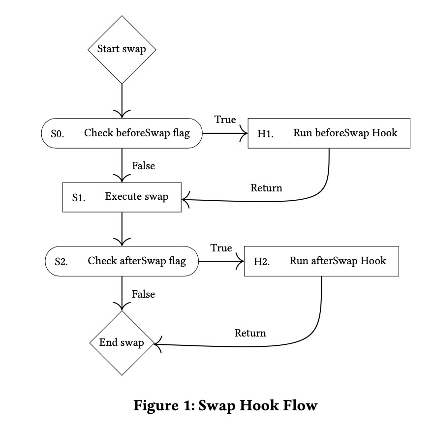

# UniswapV4理论部分

在学V4之前，就已经听说V4跟V3的差别不太大，只增加了一些新特性，来看看吧。

## AMM算法

- 仍然使用：`x * y = k`

- 理论上，每个交易对可以有任意数量的pool，每一个pool的 fee rate 也可以是任意值，也就说，tick可以是任意值，这样也会引入问题：流动性碎片化，需要router/aggregator来找到最优交易路径

## Hooks

- 定义：一组由第三方或者 Uniswap 官方开发的合约，在创建 pool 的时候，pool 可以选择绑定一个 hook，然后在交易的特定阶段，pool 都会自动调用与之绑定的 hook 合约
- Hook拥有14个可选的执行阶段：Hook 合约需要显示指定在哪些阶段进行执行，而 pool 则需要知道对应的 Hook 在某个阶段是否需要执行

```solidity
// 初始化池子
uint160 internal constant BEFORE_INITIALIZE_FLAG = 1 << 13;
uint160 internal constant AFTER_INITIALIZE_FLAG = 1 << 12;

// 添加流动性
uint160 internal constant BEFORE_ADD_LIQUIDITY_FLAG = 1 << 11;
uint160 internal constant AFTER_ADD_LIQUIDITY_FLAG = 1 << 10;

// 移除流动性
uint160 internal constant BEFORE_REMOVE_LIQUIDITY_FLAG = 1 << 9;
uint160 internal constant AFTER_REMOVE_LIQUIDITY_FLAG = 1 << 8;

// 交易
uint160 internal constant BEFORE_SWAP_FLAG = 1 << 7;
uint160 internal constant AFTER_SWAP_FLAG = 1 << 6;

// 捐赠
uint160 internal constant BEFORE_DONATE_FLAG = 1 << 5;
uint160 internal constant AFTER_DONATE_FLAG = 1 << 4;

// 特殊：Return Delta
uint160 internal constant BEFORE_SWAP_RETURNS_DELTA_FLAG = 1 << 3;
uint160 internal constant AFTER_SWAP_RETURNS_DELTA_FLAG = 1 << 2;
uint160 internal constant AFTER_ADD_LIQUIDITY_RETURNS_DELTA_FLAG = 1 << 1;
uint160 internal constant AFTER_REMOVE_LIQUIDITY_RETURNS_DELTA_FLAG = 1 << 0;
```

使用Hook的哪个阶段，被记录在了地址当中，用掩码来看看Hook合约的地址是什么模式，这就意味着Hook需要用Creaet2的方式来部署。

```solidity
/// @notice 确保钩子地址至少包含一个钩子标志或动态费用，或者为零地址
/// @param self 要验证的钩子
/// @param fee 钩子所使用的池的费用
/// @return bool 如果钩子地址有效，则返回true
function isValidHookAddress(IHooks self, uint24 fee) internal pure returns (bool) {
    // The hook can only have a flag to return a hook delta on an action if it also has the corresponding action flag
    if (!self.hasPermission(BEFORE_SWAP_FLAG) && self.hasPermission(BEFORE_SWAP_RETURNS_DELTA_FLAG)) return false;
    if (!self.hasPermission(AFTER_SWAP_FLAG) && self.hasPermission(AFTER_SWAP_RETURNS_DELTA_FLAG)) return false;
    if (!self.hasPermission(AFTER_ADD_LIQUIDITY_FLAG) && self.hasPermission(AFTER_ADD_LIQUIDITY_RETURNS_DELTA_FLAG))
    {
        return false;
    }
    if (
        !self.hasPermission(AFTER_REMOVE_LIQUIDITY_FLAG)
            && self.hasPermission(AFTER_REMOVE_LIQUIDITY_RETURNS_DELTA_FLAG)
    ) return false;

    // If there is no hook contract set, then fee cannot be dynamic
    // If a hook contract is set, it must have at least 1 flag set, or have a dynamic fee
    return address(self) == address(0)
        ? !fee.isDynamicFee()
        : (uint160(address(self)) & ALL_HOOK_MASK > 0 || fee.isDynamicFee());
}
```

举个例子，用户在swap前后hook的执行情况如下图所示：



这里有一个很棒的hook列表：https://github.com/ora-io/awesome-uniswap-hooks

## 动态 fee ratio

- 简介：Hook 可以决定某一个 pool 的 swap fee 费率，和 withdraw 费率。withdraw 费率指的是用户在移除流动性时需要向 hook 支付的费率。除此之外，Hook 还可以指定在 swap fee 中抽成一部分给自己。

- 使用 fee 参数（uint24）前 4个 bit 来标记此 pool 是否使用动态 fee

```solidity
/// @notice 一个精确为0b1000000...的lp费用表示动态费用池。这不是一个有效的静态费用，因为它大于MAX_LP_FEE。
uint24 public constant DYNAMIC_FEE_FLAG = 0x800000;

/// @notice beforeSwap返回的费用中的第二位用于指示在此次交换中是否应覆盖存储的LP费用
// 只有动态费用池可以通过beforeSwap钩子返回费用
uint24 public constant OVERRIDE_FEE_FLAG = 0x400000;

/// @notice 掩码用于从beforeSwaphook返回的费用中移除覆盖费用标志
uint24 public constant REMOVE_OVERRIDE_MASK = 0xBFFFFF;

/// @notice LP费用以百分之一的基点表示，因此最大值为100%。
uint24 public constant MAX_LP_FEE = 1000000;
```

## Singleton 合约

- 背景：Uniswap V3 中每次创建新的 pool 都需要部署一个新的合约，这会消耗大量 gas，但是其实这些 pool 使用的代码是相同的，只是初始化参数不相同而已
- 需求：Uniswap V4 引入了 Singleton 合约，用来管理所有的 pool，这样创建新的 pool 不再需要部署新的合约了，节省了部署合约的 gas

- 优点：
  - 减少交易过程中 token 的转账：因为所有的 pool 都在同一个合约中，所以可以直接在合约内部完成跨 pool 的 swap
  - 使用闪电贷借大量 token 更方便：在 V4 中，所有 pool 使用同一个合约，并且合约内部的 token 记账也被简化为每种 token 按 token 来记账，而不是按 pool 来记账

## extload

- 为了方便 Hook 和其他合约的 integration，V4 合约增加了 `extload` 函数，这样合约所有内部 states 都变成外部可读了，所有 pool 的状态将对外部完全透明。

## Flash Accounting

- 目的：减少跨 pool swap 的 token 转账，将 swap, add/remove liquidity/flash loan 的过程都标准化成一种类似闪电贷的过程（这些过程需要发生在一个交易中）：

  - 用户获取一个 lock

  - 用户进行任何操作，例如在多个 pool 中 swap，add/remove liquidity，或者通过闪电贷向 pool 借 token

  - 用户所有操作所产生的 token 转账都会被记录在 lock 中

  - 所有操作结束后，用户可以取走他获得的 token，同时需要支付 lock 中记录他需要支付的 token

> 这样一来，如果一个交易中需要跨多个 pool 进行 swap，在结算时只需要两笔转账就够了。例如，在一次 ETH->USDC-BTC 这样的 swap 中，USDC 作为中间 token 完全不需要任何转账。

- 新特性：交换过程中，Native ETH和ERC20代币可以直接转换，无需中介
- 结合使用了 EIP-1153 中提议的瞬态存储操作码，节省gas

## ERC6909

Flash Accounting 可以减少同一个笔交易中 swap 的 token 转账，通过使用 ERC6909 ，可以进一步减少多个交易的 token 转账。

ERC6909 在接口上与 ERC1155 是类似的。该合约可以实现多种 ERC20 代币存放在同一个合约内，并在同一个合约内管理。

V4 允许通过 ERC6909 mint，将属于你的 token 保存在 V4 合约中，这样你就可以在多个交易中使用这些 token，而不需要每次都将 token 转账到 V4 合约中。

```solidity
function mint(address to, uint256 id, uint256 amount) external onlyWhenUnlocked {
    unchecked {
        Currency currency = CurrencyLibrary.fromId(id);
        // negation must be safe as amount is not negative
        _accountDelta(currency, -(amount.toInt128()), msg.sender);
        _mint(to, currency.toId(), amount);
    }
}

// 上述函数并没有具体的代币转入流程，这是因为 Uniswap V4 引入了 Flash Accounting 机制，我们会在合约的闪存(transient storage) 内存入代币的盈亏数值，并在交易完成时做最终结算。我们可以看到此处使用 _accountDelta(currency, -(amount.toInt128()), msg.sender); 语句在为用户减少了一部分资产。
```

使用 ERC6909 burn 可以将保存在 V4 合约中的 token 取出。

```solidity
function burn(address from, uint256 id, uint256 amount) external onlyWhenUnlocked {
    Currency currency = CurrencyLibrary.fromId(id);
    _accountDelta(currency, amount.toInt128(), msg.sender);
    _burnFrom(from, currency.toId(), amount);
}
```

ERC6909 适合频繁 swap 或 add/remove liquidity 的用户，这些用户可以将常用的 token 直接保存在 V4 合约中，这样可以减少 token 转账的 gas 开销。

## ERC 7751 和 Custom Revert

为了优化异常的抛出，Uniswap v4 引入了 ERC 7751 协议，并编写了 `CustomRevert` 库来处理 Revert。所谓的 ERC 7751 是一种带有上下文的错误抛出方法。一个简单的应用场景是当 Uniswap V4 出现报错后，在之前的情况下，我们不知道是 Uniswap v4 的主合约给出的报错还是因为 ERC20 代币实现给出的报错，我们只能通过 trace 的方式发现调用出错的位置。但 ERC 7751 允许我们给出报错的合约地址以及相关的上下文，这可以使得开发者不在 trace 的情况下就可以快速判断问题。

上述功能在 `src/libraries/CustomRevert.sol` 内的 `bubbleUpAndRevertWith` 函数内进行了实现。

## 预言机

引入了 Hooks 机制之后，像 UniswapV2 和 UniswapV3 内嵌的价格预言机也变得不再必要了，因此，在 PoolManager 中再见不到价格预言机相关的数据存储和逻辑处理了。因为预言机可以通过 Hooks 合约定制化实现了。


参考

- https://paco0x.org/uniswap-v4-new-features/
- https://blog.wssh.trade/posts/uniswap-v4/
- https://learnblockchain.cn/article/6941
